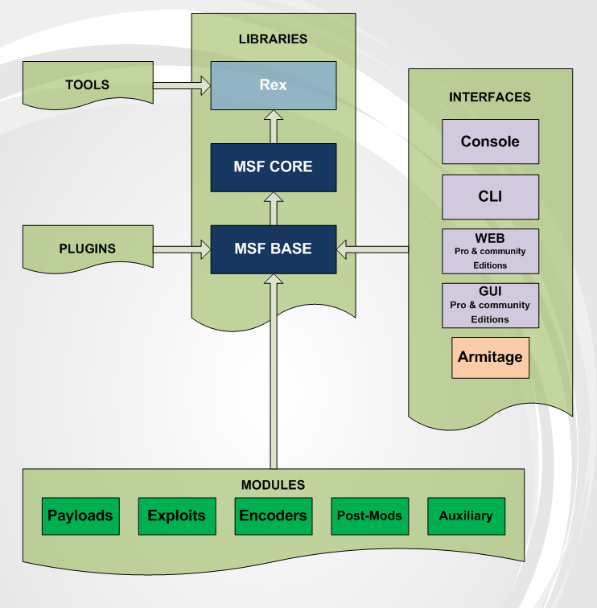

- 玩转Metasploit系列——Freebuf:
  - [玩转Metasploit系列（第一集）](http://www.freebuf.com/sectool/67674.html)
  - [玩转Metasploit系列（第二集）](http://www.freebuf.com/sectool/67685.html)
  - [玩转Metasploit系列（第三集）](http://www.freebuf.com/sectool/67923.html)
  - [玩转Metasploit系列（第四集）](http://www.freebuf.com/sectool/68205.html)
  - [玩转Metasploit系列（第五集）](http://www.freebuf.com/sectool/68409.html)
  - [玩转Metasploit系列（第六集）](http://www.freebuf.com/sectool/69358.html)
  - [玩转Metasploit系列（第七集）](http://www.freebuf.com/sectool/69362.html)
  - [玩转metasploit系列（第八集）](http://www.freebuf.com/articles/82872.html)


> Metasploit就是一个漏洞框架。它的全称叫做The Metasploit Framework，简称叫做MSF。Metasploit作为全球最受欢迎的工具，不仅仅是因为它的方便性和强大性，更重要的是它的框架。它允许使用者开发自己的漏洞脚本，从而进行测试。

#### Metasploit结构简介



主目录结构:
```bash
root@kali:/usr/share/metasploit-framework# tree -L 1 -d
.
├── app
├── config     
├── data      里面存放一些可编辑的文件，主要是给Metasploit使用
├── db        MSF数据库文件
├── lib       MSF框架的主要组成部分
├── modules   MSF的模块存放位置(模块由ruby编写)
├── plugins   存放Metasploit的插件
├── scripts   存放Meterpreter代码（shell code）或者是其他的脚本文件
├── tools     各种各样实用的命令行工具
└── vendor
```

<h2 style="color: red;">msfconsole</h2> 

> `msfconsole`是一个强大的接口程序。`msfconsole`提供了一个一体化的集中控制台。通过`msfconsole`，你可以访问和使用所有的`metasploit`的插件，payload，利用模块，post模块等等。msfconsole还有第三方程序的接口，比如nmap，sqlmap等，可以直接在`msfconsole`里面使用


<h3 style="color: red">msfconsole参数:</h3>

help或?  
```
获取帮助菜单
`help+参数` 获取某项参数的帮助
```

banner
```
查看metasploit的版本信息，利用模块数量、payload数量等
```

color
```
设置一些命令行的颜色,没什么实质的作用。‍‍
```
exit
```
退出msfconsole
```

connect
```
用于远程连接主机。一般用于内网渗透。比较常用的命令就是 connect 192.168.0.1 8080

Usage: connect [options] <host> <port>

Communicate with a host, similar to interacting via netcat, taking advantage of
any configured session pivoting.

OPTIONS:

    -C        Try to use CRLF for EOL sequence.
    -P <opt>  Specify source port.
    -S <opt>  Specify source address.
    -c <opt>  Specify which Comm to use.
    -h        Help banner.
    -i <opt>  Send the contents of a file.
    -p <opt>  List of proxies to use.
    -s        Connect with SSL.
    -u        Switch to a UDP socket.
    -w <opt>  Specify connect timeout.
    -z        Just try to connect, then return.
```

jobs
```
查看目前msfconsole上存在哪些任务，并且可以选择结束一些不需要的任务

Usage: jobs [options]

Active job manipulation and interaction.

OPTIONS:

    -K        Terminate all running jobs.
    -h        Help banner.
    -i <opt>  Lists detailed information about a running job.
    -k <opt>  Terminate jobs by job ID and/or range.
    -l        List all running jobs.
    -v        Print more detailed info.  Use with -i and -l
```

kill
```
主要是配合jobs参数进行使用。如果你使用jobs参数后发现了一些不要的任务，那么使用kill参数就可以终止一些不需要的进程。一般都是kill <jobs编号>
```

load
```
从metasploit的plug库里面加载一些插件
eg: load wiki
```

unload
```
终止已经启动的插件‍‍

eg: unload wiki
```

route
```
‍route参数主要是用来当做跳板,这个参数的作用就是做代理转发

Usage: route [add/remove/get/flush/print] subnet netmask [comm/sid]

Route traffic destined to a given subnet through a supplied session.
The default comm is Local.
```
如何使用route做跳板的文章: [Metasploit渗透技巧：后渗透Meterpreter代理](http://www.freebuf.com/sectool/56432.html)

search
```
搜索各种模块,插件等等。

Usage: search [keywords]

Keywords:
  app       :  Modules that are client or server attacks
  author    :  Modules written by this author
  bid       :  Modules with a matching Bugtraq ID
  cve       :  Modules with a matching CVE ID
  edb       :  Modules with a matching Exploit-DB ID
  name      :  Modules with a matching descriptive name
  platform  :  Modules affecting this platform
  ref       :  Modules with a matching ref
  type      :  Modules of a specific type (exploit, auxiliary, or post)

Examples:
  search cve:2009 type:exploit app:client
```

session
```
交互，查询或者终止当前的一些会话。如果要查看session的选项

```

set
```
payload或者其他模块进行设置。比如设置攻击目标的IP就是"set RHOST 192.168.0.2"
```

unset
```
如果你使用set命令后，发现设置错误了，可以选择unset重新设置
```

setg
```
这个和set有些类似，但是不同的是这个是一个全局变量设置。设置一次后再保存，那么以后，这个漏洞模块你就不用重复设置。但是请注意！如果你在某一个模块设置了全局变量，那么以后使用这个模块的时候请检查option选项。以免做重复的渗透工作。当然，如果你设置错误了，也可以用unsetg命令来重新设置。
```

show
```
如果单纯的输入show，那么就会显示出所有的payload，利用模块，post模块，插件等

如果要显示利用模块，那么就输入show exploits。如果要显示payload，那么就输入show payloads。总共可以使用的是那么几个命令  ;show auxiliary;, ;show exploits;, ;show payloads;, ;show encoders;, 和 ;show nops;

msf > help show 
[*] Valid parameters for the "show" command are: all, encoders, nops, exploits, payloads, auxiliary, plugins, info, options
[*] Additional module-specific parameters are: missing, advanced, evasion, targets, actions


```

use
```

```