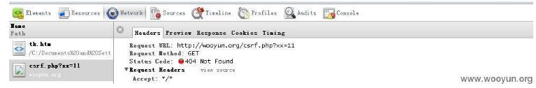

### CSRF简单介绍及利用方法

- [CSRF简单介绍及利用方法--wooyun](http://localhost/wooyun_drops/drops/papers-155.html)
- [邪恶的CSRF--wooyun](http://localhost/wooyun_drops/drops/web-15556.html)
- [安全性测试--CSRF攻击](http://www.uml.org.cn/Test/201508124.asp)
- [从零开始学CSRF--Freebuf](http://www.freebuf.com/articles/web/55965.html)
- [我是如何通过CSRF拿到Shell的--Freebuf](http://www.freebuf.com/vuls/148257.html)

####  0x01 简要介绍

CSRF(Cross-site request forgery)跨站请求伪造，由于目标站无token/referer限制，导致攻击者可以用户的身份完成操作达到各种目的。根据HTTP请求方式，CSRF利用方式可分为两种。

##### GET类型的CSRF

这种类型的CSRF一般是由于程序员安全意识不强造成的。GET类型的CSRF利用非常简单，只需要一个HTTP请求，所以，一般会这样利用：

```
 
```



乌云相关案例:

[GET型csrf----乌云搜索](http://127.0.0.1:8000/wysearch/?q=GET%E5%9E%8BCSRF&s_type=wooyun)

##### 0x02 POST类型的CSRF

这种类型的CSRF危害没有GET型的大，利用起来通常使用的是一个自动提交的表单，如:
```
<form action=http://wooyun.org/csrf.php method=POST>
<input type="text" name="xx" value="11" />
</form>
<script> document.forms[0].submit(); </script> 
```

访问该页面后，表单会自动提交，相当于模拟用户完成了一次POST操作。

乌云相关案例：

- [phpok csrf添加管理员+后台getshell](http://localhost/wooyun/bug_detail.php?wybug_id=wooyun-2015-091886)
- [phpok csrf成功getshell(二)](http://localhost/wooyun/bug_detail.php?wybug_id=wooyun-2015-091875)
- [知乎CSRF](http://localhost/wooyun/bug_detail.php?wybug_id=wooyun-2012-08640)
- [美团网多处CSRF](http://localhost/wooyun/bug_detail.php?wybug_id=wooyun-2016-0170006)
- ......

##### 0x03 其他猥琐流CSRF

过基础认证的CSRF(常用于路由器):

POC:
```
 
```

加载该图片后，路由器会给用户一个合法的SESSION，就可以进行下一步操作了。

乌云相关案例：

WooYun: TP-LINK路由器CSRF，可干许多事（影响使用默认密码或简单密码用户）