### 创建VPN服务器

1、 在服务器管理器中添加角色<strong style="color: red">网络策略和访问服务</strong>，并安装网络策略和访问服务、路由和远程访问服务。

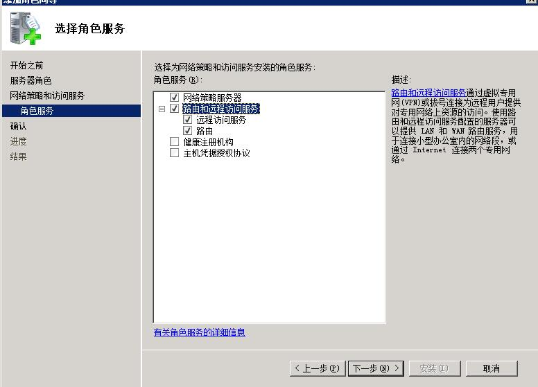

2、 开始->管理工具->路由和远程访问 中打开RRAS：

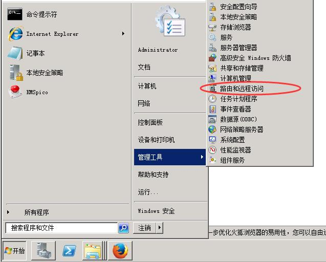

3、 点击服务器状态，可看到目前只有一台服务器,右击选择配置并启用路由和远程访问打开向导
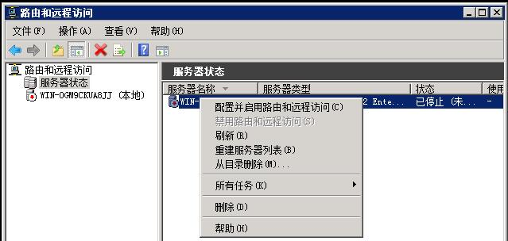

4、如果服务器有两张网卡，选择"远程访问(拨号或VPN)"，如果只有一张网卡，则选择自定义配置并在下一步中勾选VPN。

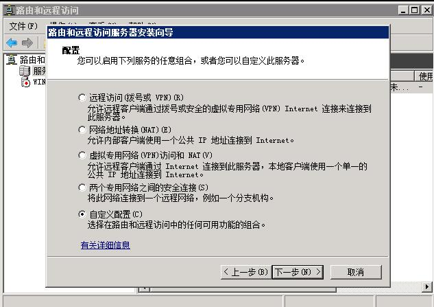

5、然后就可以完成了。这时候会跳出一个提示：

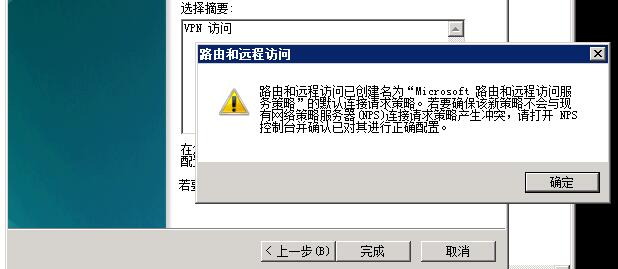

就是说叫你用NPS来管理对RRAS的访问策略。确定之后启动服务

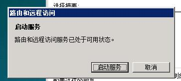

6、右击服务器名并选择属性,转到IPv4标签页。

7、这里可以选择DHCP或静态地址池。DHCP需要有DHCP服务器，因为涉及到DHCP服务器的配置等等，我们从简跳过。选择静态地址池，添加一个地址段

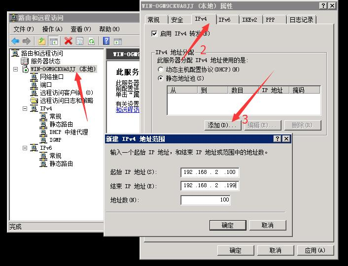

8、确认后 RRAS 的配置已经完成了开始配置 NPS,在开始->管理工具->网络策略服务器中打开NPS

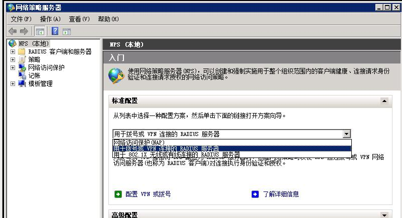

9、 点击配置vpn或拨号,添加一个RADIUS客户端，取个友好名称，输入地址，然后生成一个共享机密，当然手动输入也可以。这不是密码

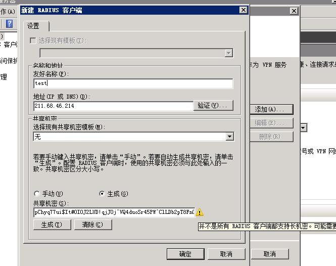

10、身份验证默认就好。然后就是选择组。

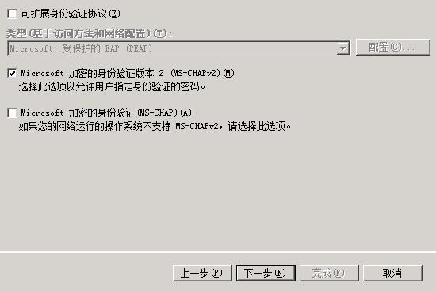

这里解释下，我们选择了MS-CHAPv2认证，那么我们需要指定授权给VPN拨入的用户组。

我这里添加了Administrators和Users组。最好是新建一个组专门用于VPN接入，不过这里简略点就用了现成的用户组。

下一步 IP筛选器，默认就好。

下一步 指定加密设置，同默认。

下一步 指定一个领域名称，不用管，默认。

到这里就完成啦。

11、 给VPN连接建立账户

在 开始->管理工具->服务器管理 中，打开  配置->本地用户与组->用户 ，右击右边窗口并新建一个用户vpn并设置密码为123456

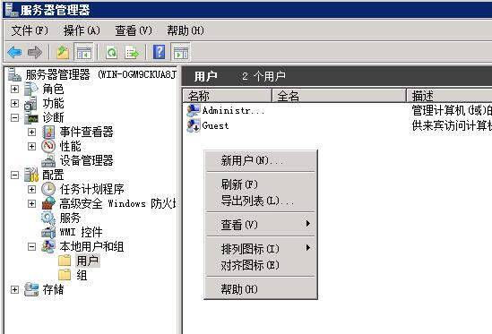

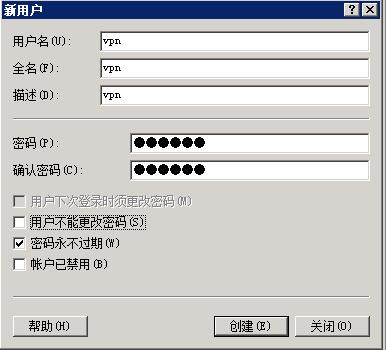

新用户默认隶属于Users组。已经具备VPN拨入权限

到这里VPN就建立完成了

### 客户端建立连接

1、网络与共享中心 ----> 设置新的连接或网络 ----> 连接到工作区 ----> 使用我的Internet连接(VPN) ----> 输入ip,名称随意 ----> 创建

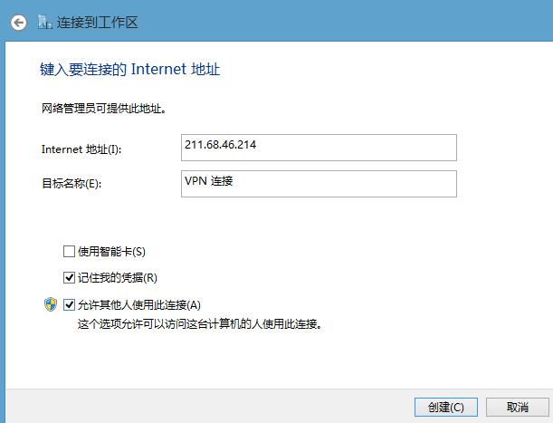

2、 
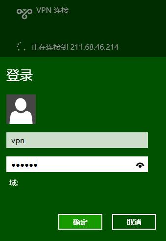

3、连接成功

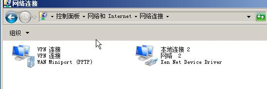
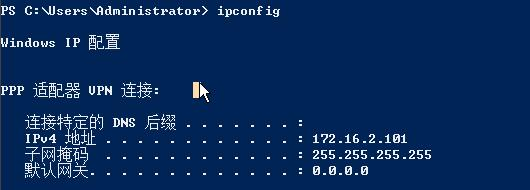

4、另外远程服务器能连上,学校内的ip连接不上vpn,应该是在路由器上面禁了对远程pptp 1723端口的访问,有句mmp一定要讲

5、
<h1 style="color: red">所以正向代理翻墙还是使用 socks 或者 ssh协议!</h1>

<h1 style="color: red">Shadowsocks大法好</h1>

<h1 style="color: red">配置简单</h1>

<h1 style="color: red">服务稳定</h1>
