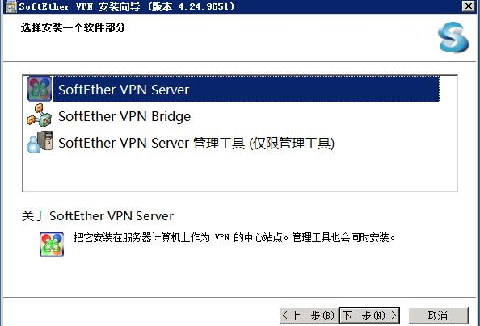
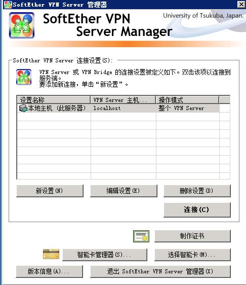
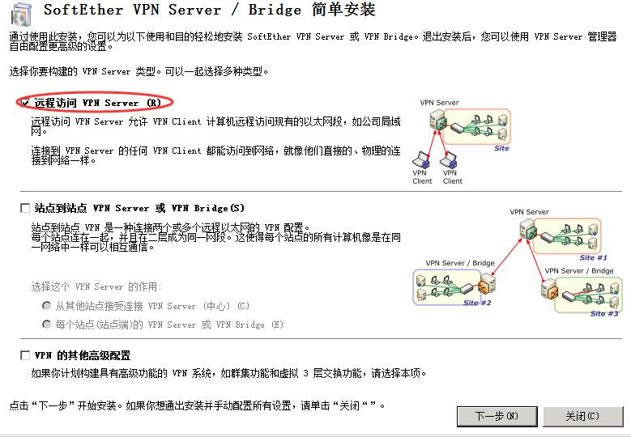
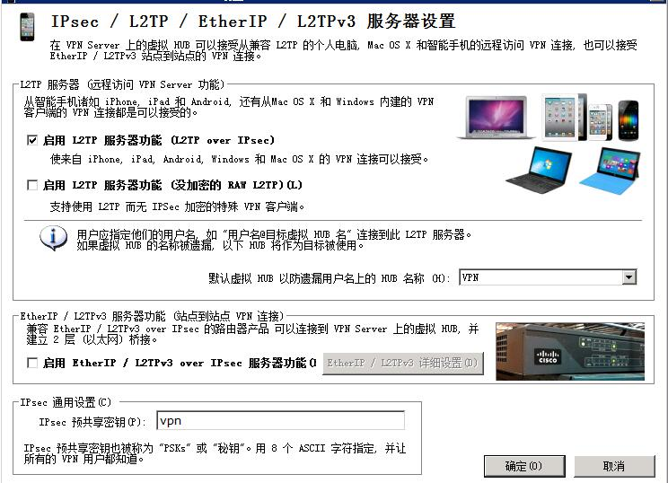
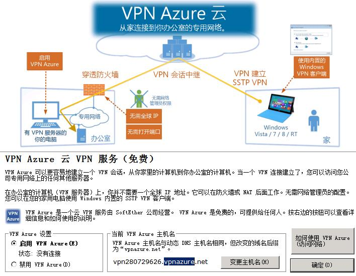
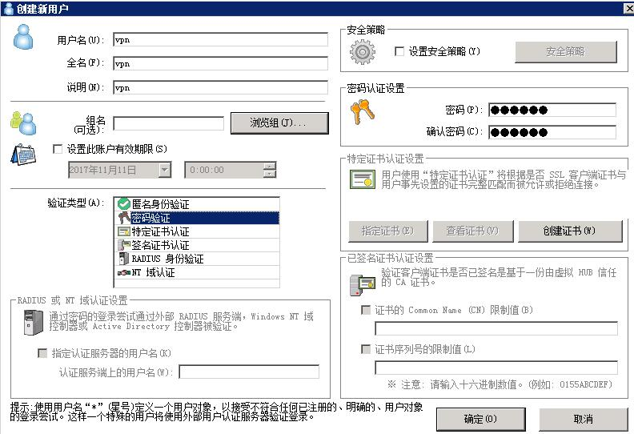
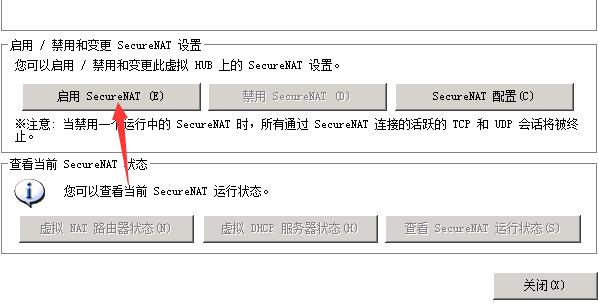
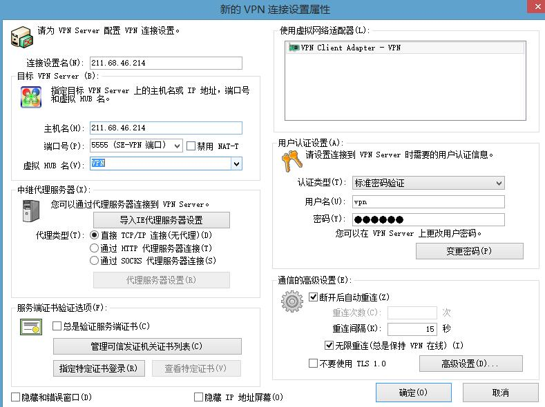

> SoftEther VPN是日本筑波大学的一个研究项目，它包括服务器端、客户端、服务器端管理工具等数个软件，支持 SSL-VPN (SoftEther VPN) 协议、 L2TP/IPsec 协议、 OpenVPN 协议和 Microsoft SSTP 协议，Windows、Linux、Android和IOS等操作系统都可以连接到SoftEther VPN服务器。

下载地址:

- [SoftEther VPN官网下载](http://www.softether-download.com/cn.aspx?product=softether)
- [VPN Gate Client](http://www.vpngate.net/cn/download.aspx)

<h3 style="color: red"> Windows搭建 SoftEther VPN 服务器</h3>
1、选择 SoftEther VPN Server

2、同意协议,一直下一步,开启 SoftEther VPN Server 管理工具

3、编辑设置,设置管理员密码

4、选择远程访问 VPN Server

5、启用 L2TP 服务器功能

6、可选vpn azure云服务 用于穿透内网

7、创建用户,设置用户密码

8、双击Hub,设置 NAT 和虚拟 DHCP 服务器

9、启用secureNAT

<h3 style="color: red">VPN Client连接</h3>

1、 填写连接信息

2、 连接成功

参考:

- [通过使用 SoftEther VPN (SSL-VPN) 连接到 VPN Gate](http://www.vpngate.net/cn/howto_softether.aspx)
- [通过SoftEther，在VPS上轻松搭建VPN服务器图文教程](http://www.pcrooms.com/post/softether-vpn.html)
- [SoftEtherVPN——轻松搭建VPN服务器](https://blog.feixueacg.com/softethervpn-easyvpn/)
- [SoftEther vpn server做跳板机（图文）](https://blog.whsir.com/post-1054.html)