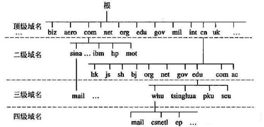
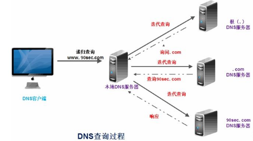
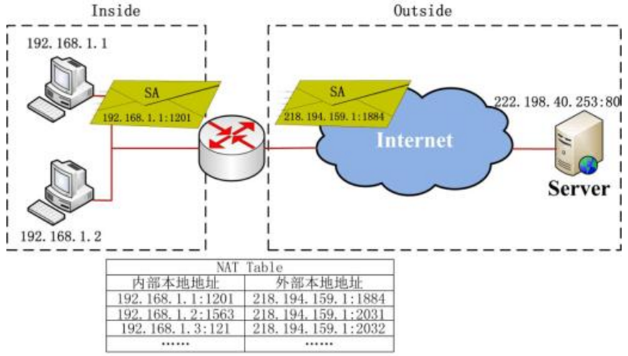
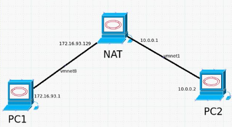
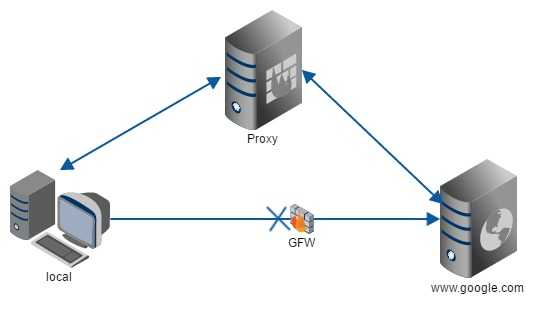
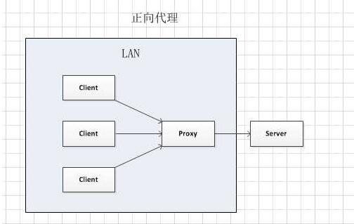
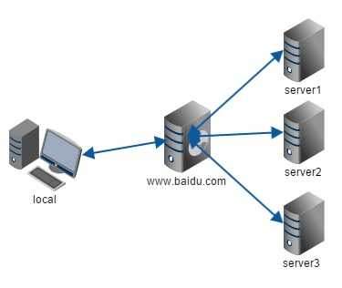
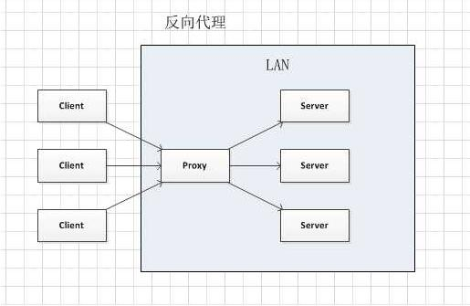

#### IP地址

<p style="color: red;">网络中唯一定位一台设备的逻辑地址，类似我们的电话号码</p>

在互联网中我们访问一个网站或使用一个网络服务最终都需要通过IP定位到每一台主机

IP地址是IP协议提供的一种统一的地址格式，它为互联网上的每一个网络和每一台主机分配一个逻辑地址，以此来屏蔽物理地址的差异。

内网IP可以同时出现在多个不同的局域网络中，如A公司的U1用户获得了192.168.0.5，B公司的U3用户也可以获得192.168.0.5；但公网IP是唯一的，因为我们只有一个Internet。
```
# 局域网可使用的网段（私网地址段）有三大段:

10.0.0.0~10.255.255.255（A类）
172.16.0.0~172.31.255.255（B类）
192.168.0.0~192.168.255.255（C类）
```
<hr>

#### 域名

<p style="color: red;">域名是IP的别名，便于记忆，域名最终通过DNS服务器解析成IP地址。</p>

ipv4是一个32位的二进制数字,ipv6有128位,要记住一串毫无意义的数字非常困难,域名解决了这个问题



DNS查询过程如下，最终将域名变成IP地址:


<hr>

#### NAT

<p style="color: red;">NAT（Network Address Translation）即网络地址转换，NAT能将其本地地址转换成全球IP地址。</p>

内网的一些主机本来已经分配到了本地IP地址（如局域网DHCP分配的IP），但现在又想和因特网上的主机通信（并不需要加密）时，可使用NAT方法。

通过使用少量的公有IP 地址代表较多的私有IP 地址的方式，将有助于减缓可用的IP地址空间的枯竭

NAT不仅能解决了lP地址不足与共享上网的问题，而且还能够有效地避免来自网络外部的攻击，隐藏并保护网络内部的计算机。

多路由器可完成NAT功能。

##### NAT的实现方式:

- **静态转换:** 是指将内部网络的私有IP地址转换为公有IP地址，IP地址对是一对一
- **动态转换:** 是指将内部网络的私有IP地址转换为公用IP地址时，IP地址是不确定的，是随机的
- **端口多路复用（Port address Translation,PAT):** 内部网络的所有主机均可共享一个合法外部IP地址实现对Internet的访问，从而可以最大限度地节约IP地址资源。同时又可隐藏网络内部的所有主机，有效避免来自internet的攻击。因此，目前网络中应用最多的就是端口多路复用方式
- **应用程序级网关技术（Application Level Gateway）ALG:** 传统的NAT技术只对IP层和传输层头部进行转换处理，ALG它能对这些应用程序在通信时所包含的地址信息也进行相应的NAT转换


<hr>
### 代理

> 代理被广泛应用于计算机领域，主要分为正向代理与反向代理,正向代理代理的对象是客户端，反向代理代理的对象是服务端

#### 正向代理

> 比如X花店代Bob向Alice送匿名的生日鲜花，这里的X花店就是Bob代理，花店代理的是客户，隐藏的是客户。这就是正向代理代理

我们常说的代理也就是只正向代理，<span style="color: red;">正向代理的过程，它隐藏了真实的请求客户端，服务端不知道真实的客户端是谁</span>，客户端请求的服务都被代理服务器代替来请求，某些科学上网工具扮演的就是典型的正向代理角色。用浏览器访问[https://www.google.com](https://www.google.com) 时，被残忍的block，于是你可以在国外搭建一台代理服务器，让代理帮我去请求google.com，代理把请求返回的相应结构再返回给我。



当多个客户端访问服务器时服务器不知道真正访问自己的客户端是哪一台。<span style="color: red;">正向代理中,proxy和client同属一个LAN,对server透明</span>



##### 正向代理的实现

- 1、 用户希望代理服务器帮助自己，和要访问服务器通信，为了实现此目标，需要以下工作：
	- 1.1、 用户IP报文的目的IP = 代理服务器IP
	- 1.2、 用户报文端口号 = 代理服务器监听端口号
	- 1.3、 HTTP 消息里的URL要提供服务器的链接
- 2、 代理服务器可以根据c)里的链接与服务器直接通信
- 3、 服务器返回网页
- 4、 代理服务器打包3）中的网页，返回用户。
<hr>

### 反向代理

> 拨打10086客服电话，接线员可能有很多个，调度器会智能的分配一个接线员与你通话。这里的调度器就是一个代理，只不过他代理的是接线员，客户端不能确定真正与自己通话的人，隐藏与保护的是目标对象

<span style="color: red;">反向代理隐藏了真实的服务端</span>，当我们请求 `www.baidu.com` 的时候，就像拨打10086一样，背后可能有成千上万台服务器为我们服务，但具体是哪一台，你不知道，也不需要知道，你只需要知道反向代理服务器是谁就好了, `www.baidu.com` 就是我们的反向代理服务器，<span style="color: red;">反向代理服务器会帮我们把请求转发到真实的服务器那里</span>。Nginx就是性能非常好的反向代理服务器，用来做负载均衡。



反向代理中,proxy和server同属一个LAN,对client透明


##### 反向代理的实现:
- 1、需要有一个负载均衡设备来分发用户请求，将用户请求分发到空闲的服务器上
- 2、服务器返回自己的服务到负载均衡设备
- 3、负载均衡将服务器的服务返回用户
<hr>

#### http代理与socks代理

区别:

> SOCKS工作在比HTTP代理更低的层次：SOCKS使用握手协议来通知代理软件其客户端试图进行的连接SOCKS，然后尽可能透明地进行操作，而常规代理可能会解释和重写报头（例如，使用另一种底层协议，例如FTP；然而，HTTP代理只是将HTTP请求转发到所需的HTTP服务器）

> 虽然HTTP代理有不同的使用模式，CONNECT方法允许转发TCP连接；然而，SOCKS代理还可以转发UDP流量和反向代理(SOCKS V4只支持 TCP连接，而SOCKS V5在其基础上增加了安全认证以及对UDP协议的支持)，而HTTP代理不能。HTTP代理通常更了解HTTP协议，执行更高层次的过滤。

> SOCKS代理在任何情况下都不会中断server与client之间的数据,HTTP代理可以中断连接（即在中间截断数据流），因为HTTP代理是以HTTP请求为基础的 而这些请求大多以明文形式存在，所以HTTP代理可以在Client和下游服务器中间窃听，修改数据。

正向socks/http代理应该就是我们最常见的这种浏览器代理，通过代理服务器来进行抓包或者传送流量给对方服务器,常见工具的话就是burp或者fiddler

反向代理是先在服务器A(比如攻击机)上运行 SOCKS代理的服务端程序监听指定端口，然后在客户机（比如靶机）上运行客户端程序连接服务器的指定端口。这样就建立了一条从靶机到攻击机的反向 SOCKS 隧道，攻击机的应用程序（比如 wget nmap curl …）使用该隧道后，程序的所有流量都会先经过靶机转发出去。

<hr>

### 正向端口转发，反向端口转发，动态端口转发

<h5 style="color: red">正向端口转发:</h5>

> 把本地主机端口通过待登录主机端口转发到远程主机端口上去

正向端口转发流程:
> Lhost－－>proxy－－>Rhost

> Lhost 为了访问到 Rhost，向 proxy 发送了一个请求并且指定目标是 Rhost，然后 proxy 向 Rhost 转交请求并将获得的内容返回给 Lhost，简单来说正向代理就是 proxy 代替了我们去访问 Rhost。

```bash
ssh -L 50000:www.google.com:80 user@host

当成功执行上面的命令之后，访问本地的50000端口，就等同于访问 www.google.com 的 80 端口。但和直接访问有着本质的区别：这次是通过登录主机来安全转发数据的，没有人知道你和远程主机之间传输了何种数据。就算你不能和远程主机建立连接（而登录主机能访问），那就能突破（绕过）防火墙的限制
```

<h5 style="color: red"反向端口转发></h5>

这里就是指把登录主机端口通过本地主机端口转发到远程主机上

```bash
ssh -R 0.0.0.0:8080:localhost:80 user@host。
```
当成功执行上面的命令之后，访问登录主机的 8080 端口就相当于访问远程主机的80端口！

设想这样一种情况：你在本机开发了一个web应用，想拿给别人测试，但现在你却处在内网，外网是无法直接访问内网的主机的，怎么办！？很多人可能会说，找台有公网IP的主机，重新部署一下就行了。这样可行，但太麻烦。然而自从你了解了的反向端口转发功能之后，一切都变得简单了。只需在本地主机上执行一下上面例子的命令即可实现外网访问内网web应用。

反向端口转发的流程：

> Lhost<--->proxy<--->firewall<--->Rhost

> Lhost 只向 proxy 发送普通的请求，具体让他转到哪里，proxy 自己判断，然后将返回的数据递交回来，这样的好处就是在某些防火墙只允许 proxy 数据进出的时候可以有效的进行穿透

反向端口转发穿透内网神器: <strong style="color: red;">ngrok,lanproxy</strong>

参考链接:

- [一分钟实现内网穿透（ngrok服务器搭建----CSDN](http://blog.csdn.net/zhangguo5/article/details/77848658)
- [反向代理为何叫反向代理?----知乎](https://www.zhihu.com/question/24723688)
- [一些关于代理的知识](https://mp.weixin.qq.com/s?__biz=MjM5MTYxNjQxOA==&mid=2652845349&idx=1&sn=046cfd1c96872771d57d4a4c3b4000c4&chksm=bd5949e88a2ec0fefc90210d3b9b3304c38ee01d2f61abd1e30ebbece3827c635b279198bb8f&mpshare=1&scene=23&srcid=1109x2Af3YuZEB1l7TNex1Xk#rd)
- [Socks代理和http代理的区别 ---- Wrfly's blog](https://wrfly.kfd.me/SOCKS%E4%BB%A3%E7%90%86%E5%92%8CHTTP%E4%BB%A3%E7%90%86%E7%9A%84%E5%8C%BA%E5%88%AB/)
- [http,socks4,socks5代理的区别 ---- 开源中国](https://my.oschina.net/aiguozhe/blog/127279)