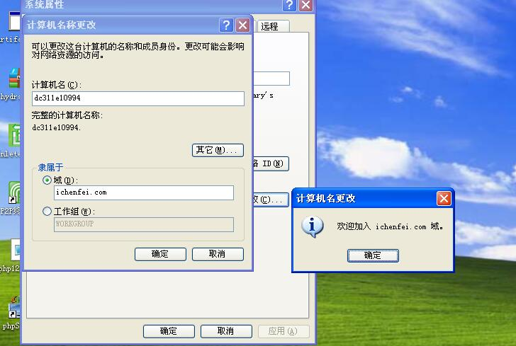
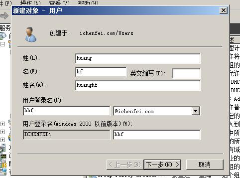

### 域（Domain）

> 将网络中多台计算机逻辑上组织到一起，进行集中管理，这种区别于工作组的逻辑环境叫做域
> 域是组织与存储资源的核心管理单元

### 域控制器（Domain Controller）

- 在域中，至少有一台DC，一般情况下一个域会有多台DC
- 域控制器中保存着整个域的用户帐号和安全数据库
- 安装有Active Directory的主机


#### 搭建域控制器相关链接

- [Windows Server 2008 R2 配置AD(Active Directory)域控制器](http://www.cnblogs.com/zhongweiv/archive/2013/01/04/win2008_addomain_configuration.html)
- [AD域环境的搭建 基于Server 2008 R2](https://www.bbsmax.com/A/A7zgo6elz4/)

### 域环境搭建步骤:

- 配置域环境:
	- 1、配置静态ip,DNS服务器设置为`127.0.0.1`
	- 2、在 `服务器管理器` ---- `角色` 中添加 `Active Directory 域服务` 角色
	- 3、`Win + R` 运行 `dcpromo`,配置域服务
	- 4、 `角色` - `Active Directory 域服务` - `User` 填加域用户 `hhf`
- 加入域环境：
	- 1、配置DNS服务器为域控服务器
	- 2、`计算机` - `属性` - `域` - 填写`ichenfei.com`
	- 3、输入域管理员账号密码
	- 4、重启登录: 用户名: `hhf@ichenfei.com` 密码 `Aa123456.`




#### 内网(域)渗透 基本命令
```
————————————————————————————————————

ipconfig /all                ------ 查询本机IP段，所在域等 
net user                     ------ 本机用户列表 
net localhroup administrators       ------ 本机管理员[通常含有域用户] 
net user /domain                        ------ 查询域用户 
net group /domain                      ------ 查询域里面的工作组
net group "domain admins" /domain       ------ 查询域管理员用户组 
net localgroup administrators /domain    ------ 登录本机的域管理员
net localgroup administrators workgroup\user001 /add   ------域用户添加到本机
net group "domain controllers" /domain                         ------ 查看域控制器(如果有多台) 
net time /domain          ------ 判断主域，主域服务器都做时间服务器 
net config workstation   ------ 当前登录域 
net session                  ------ 查看当前会话 
net use \\ip\ipc$ pawword /user:username      ------ 建立IPC会话[空连接-***] 
net share                    ------  查看SMB指向的路径[即共享]
net view                      ------ 查询同一域内机器列表 
net view \\ip                ------ 查询某IP共享
net view /domain         ------ 查询域列表
net view /domain:domainname        ------ 查看workgroup域中计算机列表 
net start                                         ------ 查看当前运行的服务 
net accounts                                   ------  查看本地密码策略 
net accounts /domain                      ------  查看域密码策略 
nbtstat –A ip                                   ------netbios 查询 
netstat –an/ano/anb                        ------ 网络连接查询 
route print                                      ------ 路由表
=============================================================  

dsquery computer       ----- finds computers in the directory.
dsquery contact           ----- finds contacts in thedirectory.
dsquery subnet            ----- finds subnets in thedirectory.
dsquery group             ----- finds groups in thedirectory.
dsquery ou                   ----- finds organizationalunits in the directory.
dsquery site                 ----- finds sites in thedirectory.
dsquery server             ----- finds domain controllers inthe directory.
dsquery user                ----- finds users in thedirectory.
dsquery quota              ----- finds quota specificationsin the directory.
dsquery partition         ----- finds partitions in thedirectory.
dsquery *                     ----- finds any object inthe directory by using a generic LDAP query.
dsquery server –domain Yahoo.com | dsget server–dnsname –site ---搜索域内域控制器的DNS主机名和站点名
dsquery computer domainroot –name *-xp –limit 10----- 搜索域内以-xp结尾的机器10台
dsquery user domainroot –name admin* -limit ---- 搜索域内以admin开头的用户10个
……
……
[注:dsquery来源于Windows Server 2003 Administration Tools Pack]
=============================================================    

tasklist /V                                                      ----- 查看进程[显示对应用户]
tasklist /S ip /U domain\username /P /V             ----- 查看远程计算机进程列表
qprocess *                                                    ----- 类似tasklist
qprocess /SERVER:IP                                      ----- 远程查看计算机进程列表
nslookup –qt-MX Yahoo.com                           ----- 查看邮件服务器
whoami /all                                                   ----- 查询当前用户权限等
set                                                              ----- 查看系统环境变量
systeminfo                                                    ----- 查看系统信息
qwinsta                                                        ----- 查看登录情况
qwinsta /SERVER:IP                                       ----- 查看远程登录情况
fsutil fsinfo drives                                           ----- 查看所有盘符
gpupdate /force                                            ----- 更新域策略
=============================================================   

wmic bios                                                     ----- 查看bios信息
wmic qfe                                                      ----- 查看补丁信息
wmic qfe get hotfixid                                     ----- 查看补丁-Patch号
wmic startup                                                 ----- 查看启动项
wmic service                                                 ----- 查看服务
wmic os                                                       ----- 查看OS信息
wmic process get caption,executablepath,commandline
wmic process call create “process_name” (executes a program)
wmic process where name=”process_name” call terminate (terminates program)
wmic logicaldisk where drivetype=3 get name, freespace, systemname, filesystem, size,
volumeserialnumber (hard drive information)
wmic useraccount (usernames, sid, and various security related goodies)
wmic useraccount get /ALL
wmic share get /ALL (you can use ? for gets help ! )
wmic startup list full (this can be a huge list!!!)
wmic /node:"hostname" bios get serialnumber (this can be great for finding warranty info about target)
```


#### 域渗透相关:

- [再探内网(域)渗透 ---- Freebuf](http://www.freebuf.com/articles/web/5783.html)
- [内网(域)渗透之常见命令(续) ---- Freebuf](http://www.freebuf.com/articles/web/5901.html)
- [Empire实战域渗透 ---- 嘶吼](http://www.4hou.com/technology/4704.html)
- [初探域渗透神器Empire ---- 嘶吼](http://www.4hou.com/technology/4581.html)
- [域渗透——Local Administrator Password Solution ---- 乌云知识库](http://wy.ichenfei.com/wooyun_drops/drops/tips-10496.html)
- [域渗透——Hook PasswordChangeNotify ---- 乌云知识库](http://wy.ichenfei.com/wooyun_drops/drops/tips-13079.html)
