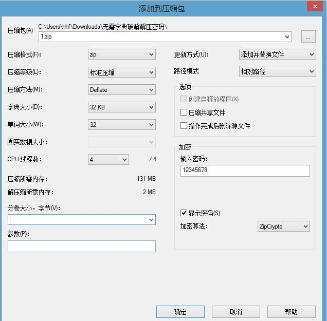

Kali Linux默认安装了这个 fcrackzip，如果你使用的是其它Linux发行版。

例如Ubuntu，执行安装命令：
```bash
sudo apt-get install fcrackzip
```

帮助文档:
```bash
root@kali:~# fcrackzip -h

fcrackzip version 1.0, a fast/free zip password cracker
written by Marc Lehmann <pcg@goof.com> You can find more info on
http://www.goof.com/pcg/marc/

USAGE: fcrackzip
          [-b|--brute-force]            use brute force algorithm
          [-D|--dictionary]             use a dictionary
          [-B|--benchmark]              execute a small benchmark
          [-c|--charset characterset]   use characters from charset
          [-h|--help]                   show this message
          [--version]                   show the version of this program
          [-V|--validate]               sanity-check the algortihm
          [-v|--verbose]                be more verbose
          [-p|--init-password string]   use string as initial password/file
          [-l|--length min-max]         check password with length min to max
          [-u|--use-unzip]              use unzip to weed out wrong passwords
          [-m|--method num]             use method number "num" (see below)
          [-2|--modulo r/m]             only calculcate 1/m of the password
          file...                    the zipfiles to crack

methods compiled in (* = default):

 0: cpmask
 1: zip1
*2: zip2, USE_MULT_TAB
```

创建测试压缩文档:



使用密码破解:
```bash
root@kali:~# fcrackzip -D -p top1000_passwords.txt 1.zip 
possible pw found: 12345678 ()
possible pw found: falcon ()
possible pw found: cowboy ()
possible pw found: playboy ()
possible pw found: tornado ()
possible pw found: slipknot1 ()
```
速度很快,虽然结果不是很精确。


参考:

[使用fcrackzip破解zip保护密码](http://topspeedsnail.com/fcrackzip-crack-zip-password/)