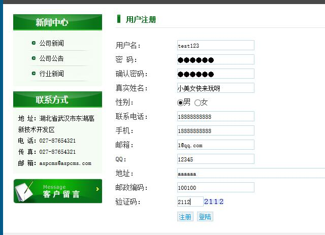
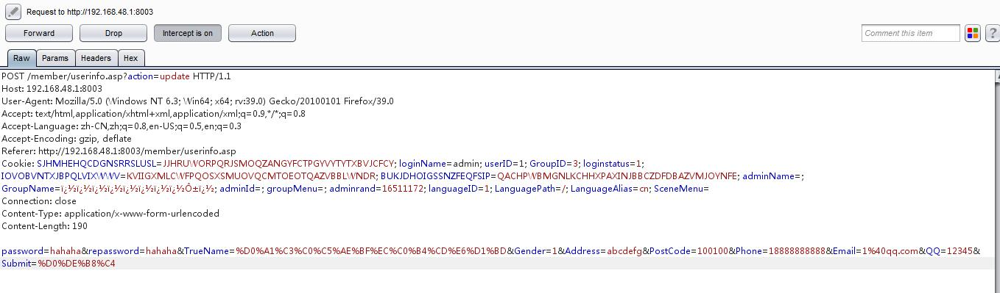

#### 参考

[aspcms任意用户密码重置 ---- wooyun-2012-07819](http://localhost/wooyun/bug_detail.php?wybug_id=wooyun-2012-07819)

> aspcms会员中心的某些页面，对用户的验证存在缺陷，修改cookie后提交即可重置任意用户的帐号信息。


#### 漏洞分析

```asp
dim action : action=getform("action","get")
if action = "reg" then
	addUser()
elseif action = "editpass" then
	editUser()
else
	echoContent()
end if

' 第3-10行 接受一个get请求,如果action为editpass时候执行editUser过程

Sub editUser
	dim LoginName,userPass,reuserPass,Email,Mobile,Address,PostCode,Gender,QQ,TrueName,Phone
	LoginName=trim(rCookie("loginName"))	
	userPass=getForm("userPass","post")	
	reuserPass=getForm("reuserPass","post")		
	
	Email=filterPara(getForm("Email","post"))
	Mobile=filterPara(getForm("Mobile","post"))
	Address=filterPara(getForm("Address","post"))
	PostCode=filterPara(getForm("PostCode","post"))
	Gender=filterPara(getForm("Gender","post"))
	QQ=filterPara(getForm("QQ","post"))
	TrueName=filterPara(getForm("TrueName","post"))
	Phone=filterPara(getForm("Phone","post"))
	
	if userPass<>reuserPass then alertMsgAndGo "两次输入密码不相同","-1" 	
	
	dim passStr
	if not isnul(userPass) then passStr="[Password]='"&md5(userPass,16)&"',"	
	Conn.Exec"update {prefix}User set "&passStr&" Email='"&Email&"',QQ='"&QQ&"',Mobile='"&Mobile&"',Address='"&Address&"',PostCode='"&PostCode&"',Gender="&Gender&",Phone='"&Phone&"',TrueName='"&TrueName&"' where LoginName='"&LoginName&"'","exe"	
	alertMsgAndGo "修改成功","editPass.asp"	
End Sub

'第24-47行 是editUser过程
'从中可以看出，对用户修改密码根本没做任何验证，cookie值是我们可以修改的
'将LoginName值修改为admin提交修改即可重置管理员信息
'同样存在此问题的还有userinfo.asp 页面
```


#### 详细说明

- 环境:
	- aspcms v2.2.9 绿色全功能模板


注册一个会员

```
http://192.168.48.1:8003/member/reg.asp
```



进入用户面板修改密码:

```
http://192.168.48.1:8003/member/userinfo.asp
```

提交抓包,修改cookie中的 `loginName=admin; userID=1`;  点击 `Forward` 

admin密码就被更改了, 有了管理员账号后进后台上传木马 so easy,妈妈再也不用担心我拿不到webshell了~~~

