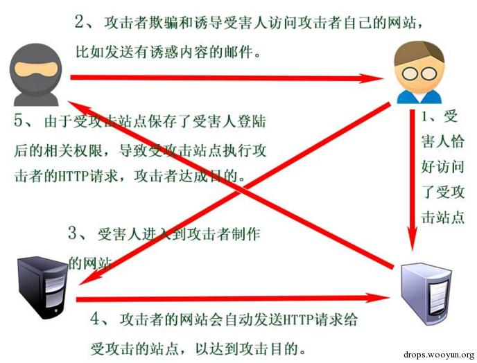

###  0x01 简要介绍

CSRF(`Cross-site request forgery`)即跨站点请求伪造。由于目标站无`token/referer`限制，导致攻击者可以用户的身份完成操作达到各种目的。根据HTTP请求方式，CSRF利用方式可分为`GET型`和`POST型`两种。

从前面这个名字里我们可以关注到两个点：一个是**跨站点**，另一个是**伪造**。前者说明了CSRF攻击发生时所伴随的请求的来源，后者说明了该请求的产生方式。所谓伪造即该请求并不是用户本身的意愿，而是由攻击者构造，由受害者被动发出的。

攻击流程如下:




##### GET类型的CSRF

这种类型的CSRF一般是由于程序员安全意识不强造成的。GET类型的CSRF利用非常简单，只需要一个HTTP请求，所以，一般会这样利用：

##### POST类型的CSRF

这种类型的CSRF危害没有GET型的大，利用起来通常使用的是一个自动提交的表单，如:
```
<form action=http://wooyun.org/csrf.php method=POST>
<input type="text" name="xx" value="11" />
</form>
<script> document.forms[0].submit(); </script> 
```
访问该页面后，表单会自动提交，相当于模拟用户完成了一次POST操作。


##### 0x03 其他猥琐流CSRF

过基础认证的CSRF(常用于路由器):

POC:
```
 
```

加载该图片后，路由器会给用户一个合法的SESSION，就可以进行下一步操作了。

#### 配合XSS

#### 乌云相关案例

- [ecshop csrf getshell](http://wy.ichenfei.com/bug_detail.php?wybug_id=wooyun-2012-013680)
	- 2012-10-21
- [帝国CMS CSRF GetShell](http://wy.ichenfei.com/bug_detail.php?wybug_id=wooyun-2013-032472)
	- 2013-07-28
- [phpok csrf成功getshell(二)](http://wy.ichenfei.com/bug_detail.php?wybug_id=wooyun-2015-091875)
	- 2015-01-16
- [PHPOK最新版CSRF 永久GETSHELL](http://wy.ichenfei.com/bug_detail.php?wybug_id=wooyun-2015-0109096)
	- 2015-04-22
- [dedecms利用xss+csrf getshell](http://wy.ichenfei.com/bug_detail.php?wybug_id=wooyun-2013-025175)
	- 2013-06-06
- [ThinkSAAS 2.2 GET型CSRF到Getshell](http://wy.ichenfei.com/bug_detail.php?wybug_id=wooyun-2014-072109)
	- 2014-08-12

#### 漏洞危害

- 篡改目标网站上的用户数据
- 盗取用户隐私数据
- 作为其他攻击向量的辅助攻击手法
- 传播CSRF蠕虫

#### 相关链接

- [CSRF简单介绍及利用方法--wooyun知识库](http://drops.ichenfei.com/papers-155.html)
- [邪恶的CSRF--wooyun](http://drops.ichenfei.com/web-15556.html)
- [安全性测试--CSRF攻击](http://www.uml.org.cn/Test/201508124.asp)
- [从零开始学CSRF--Freebuf](http://www.freebuf.com/articles/web/55965.html)
- [我是如何通过CSRF拿到Shell的--Freebuf](http://www.freebuf.com/vuls/148257.html)