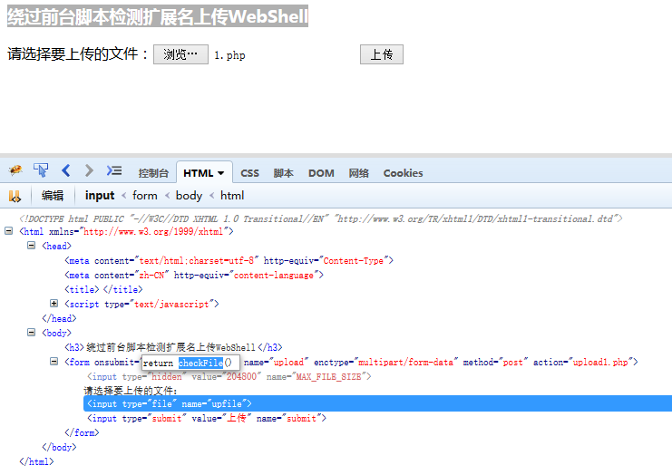

### HTTP content-type 对照表

- [HTTP content-type 对照表](http://www.runoob.com/http/http-content-type.html)
- [理解HTTP之Content-Type](http://homeway.me/2015/07/19/understand-http-about-content-type/)


### 1、绕过前端验证脚本上传文件

firebug查看源码发现前端通过`checkFile()`函数检测扩展名



源码:
```
        function checkFile() {
            var file = document.getElementsByName('upfile')[0].value;
            if (file == null || file == "") {
                alert("你还没有选择任何文件，不能上传!");
                return false;
            }
            //定义允许上传的文件类型
            var allow_ext = ".jpg|.jpeg|.png|.gif|.bmp|";
            //提取上传文件的类型
            var ext_name = file.substring(file.lastIndexOf("."));
            //alert(ext_name);
            //alert(ext_name + "|");
            //判断上传文件类型是否允许上传
            if (allow_ext.indexOf(ext_name + "|") == -1) {
                var errMsg = "该文件不允许上传，请上传" + allow_ext + "类型的文件,当前文件类型为：" + ext_name;
                alert(errMsg);
                return false;
            }
        }
```

直接删除onsubmit事件上传一句话木马:


菜刀连接:
```
http://127.0.0.1/up/uploads/1.php 密码 caidao
```


### 2、绕过Content-Type检测文件类型上传WebShell

检查发现前端没有检测函数:

使用burp suite抓包:


将 `Content-Type: application/octet-stream` 修改为 `Content-Type: image/jpeg`点`Forward`。

结果:
```
文件上传成功，保存于：uploads/2.php 
```

### 3、利用00截断上传WebShell

文件名为`3.php .jpg`
burp拦截在hex十六进制里面找到空格代表的`20`改为`00`然后`Forward`后面的字符就被截断了。上传的文件就变成了`3.php`


### 4、绕过服务器端扩展名检测上传

查看源码发现服务器对文件扩展名进行了限制，不符合要求会不允许上传。
```
$deny_ext = array('.asp', '.php', '.aspx', '.jsp');
```
windows系统中,如果文件名以`'`或者空格结尾，系统会自动去除`.`和空格。

上传"4.php"并在burp suite中将文件名改为"4.php "


上传成功

### 5、构造图片马，绕过文件内容检测上传WebShell

使用 `edjpgcom` 制作图片马


改名为 "2333.php " 上传成功

### 6、.htaccess 文件攻击上传shell

[利用Apache漏洞getshell(.htaccess 文件攻击上传shell)](http://mp.weixin.qq.com/s?__biz=MzAxMjE3ODU3MQ==&mid=2650441110&idx=2&sn=d2231fd3da6e723064f9152e9f735150&chksm=83bbe072b4cc6964b81a47b1b7940a4e5a98daad7c39cb2f172d49973aa12c8b1f6eec04d30f&scene=27#wechat_redirect)