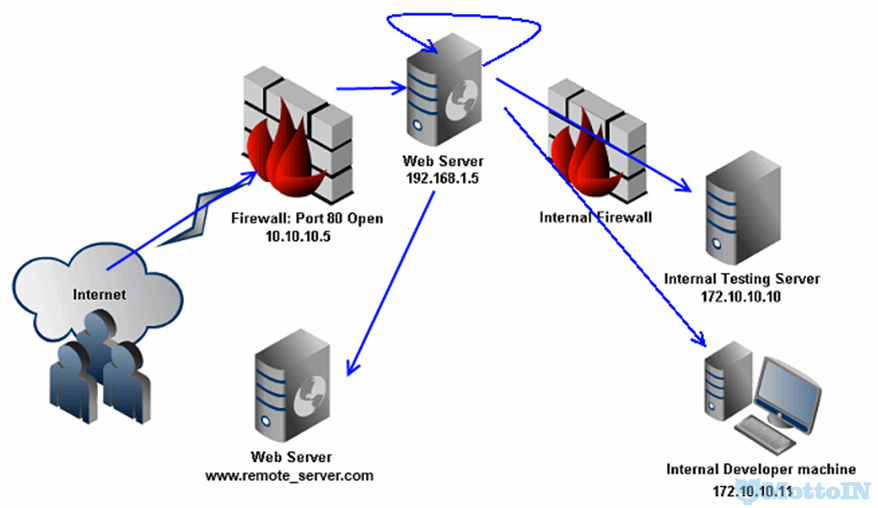

##### 介绍:

> SSRF，即服务器端请求伪造(Server Side Request Forgery)攻击.从易受攻击的服务器创建请求到内部或因特网 Internet的能力.攻击者可以使用URI模式支持的协议,与使用其他协议运行的服务进行通信.

攻击原理:

典型攻击步骤:

1. 扫描内部网络以确定您要访问网络的内部基础结构
2. 收集本地和其他内部主机的端口开放情况
3. 使用`wiki`或`Banner指纹识别`确定端口的服务/守护进程
4. 确定SSRF攻击的类型：
	- 直接套接字访问
	- 套接字客户端(如`java URI`、`cURL`、`LWP` 或其他)
5. 如果是直接套接字访问的话,使用`CRLF`或其他注射方式
6. 如果是套接字客户端,需要确定可用的URI模式
7. 比较现有的模式以及`服务`/`守护进程`的协议，找到攻击的可能性
8. 确定基于主机的认证程序,尝试利用它

##### 漏洞危害:

- 可以对外网、服务器所在内网、本地进行端口扫描,获取一些服务的banner信息
- 攻击运行在内网或本地的应用程序(比如溢出)
- 对内网Web应用进行指纹识别，通过访问默认文件实现
- 攻击内外网的Web应用,主要是使用Get参数就可以实现的攻击(比如Struts2漏洞利用，SQL注入等)
- 利用File协议读取本地文件

##### 乌云相关案例:

- [PPTV某处SSRF可探内网](http://wy.ichenfei.com/bug_detail.php?wybug_id=wooyun-2015-0103530)
- [央视网SSRF可窥探内网(Weblogic SSRF案例)](http://wy.ichenfei.com/bug_detail.php?wybug_id=wooyun-2015-0136698)
- [网易SSRF可探测内网](http://wy.ichenfei.com/bug_detail.php?wybug_id=wooyun-2015-091980)
- [有道翻译SSRF可通网易内网](http://wy.ichenfei.com/bug_detail.php?wybug_id=wooyun-2016-0212768)
- [宜搜科技ssrf内网漫游](http://wy.ichenfei.com/bug_detail.php?wybug_id=wooyun-2016-0198104)
- [百度某个从SSRF到内网WebShell之2](http://wy.ichenfei.com/bug_detail.php?wybug_id=wooyun-2015-0100037)

##### 如何防御

通常有以下5个思路:

- 过滤返回信息，验证远程服务器对请求的响应是比较容易的方法.如果web应用是去获取某一种类型的文件.那么在把返回结果展示给用户之前先验证返回的信息是否符合标准.
-  统一错误信息，避免用户可以根据错误信息来判断远端服务器的端口状态.
- 限制请求的端口为http常用的端口,比如，80,443,8080,8090.
- 黑名单内网ip.避免应用被用来获取获取内网数据，攻击内网.
- 禁用不需要的协议.仅仅允许http和https请求.可以防止类似于file:///,gopher://,ftp:// 等引起的问题.

##### 参考链接:

- [[安全科普]SSRF攻击实例解析 ---- Freebuf](http://www.freebuf.com/articles/web/20407.html)
- [SSRF漏洞中绕过IP限制的几种方法总结 ---- Freebuf](http://www.freebuf.com/articles/web/135342.html)
- [SSRF 备忘录 ---- mottoin](http://www.mottoin.com/104673.html)
- [SSRF攻击测试 ---- mottoin](http://www.mottoin.com/84709.html)
- [SSRF Tips ---- mottoin](http://www.mottoin.com/84635.html)
- [SSRF攻击原理与技巧 ---- 简书](http://www.jianshu.com/p/612c010e588e)
