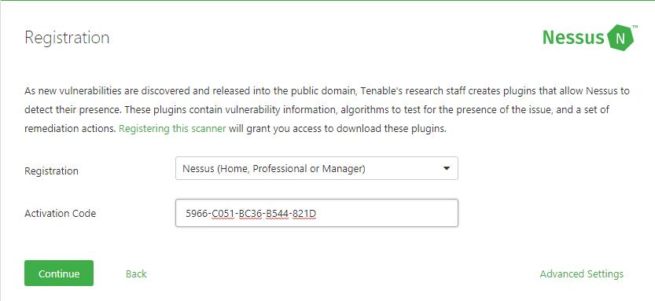
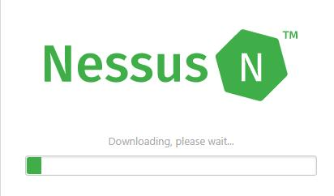
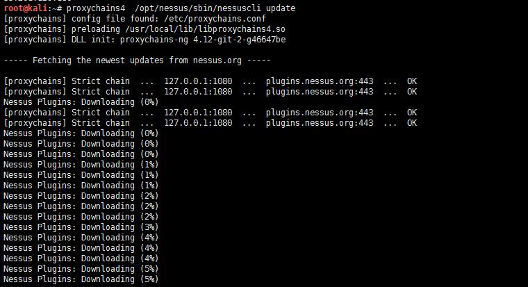
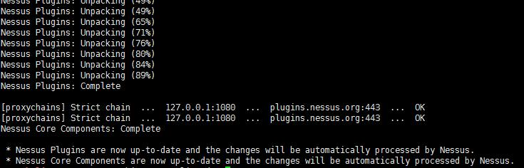

### 下载安装

下载地址:[点击直达](https://www.tenable.com/products/nessus/select-your-operating-system#download)

注册地址:[点击直达](https://www.tenable.com/products/nessus-home)

填写姓名邮箱注册后会收到一封带有激活码的邮件:
```
Your activation code for the Nessus Home is 
5966-C051-BC36-B544-821D

This is a one-time code. If you un-install and then re-install Nessus, 
you will need to register the scanner again and receive another Activation Code.
```
为了以后不收到`tenable`的产品邮件,可以使用十分钟邮箱: [10minutemail.net](https://10minutemail.net/readmail.html?mid=QEw81T)

安装并启动 nessus:

```
dpkg -i Nessus-*.deb
/etc/init.d/nessusd start 

lsof -i :8834
COMMAND  PID USER   FD   TYPE DEVICE SIZE/OFF NODE NAME
nessusd 2887 root   13u  IPv4  38898      0t0  TCP *:8834 (LISTEN)
nessusd 2887 root   14u  IPv6  38899      0t0  TCP *:8834 (LISTEN)
```

启动之后访问`https://ip:8834/#/` 

设置管理帐号和密码,设置完之后需要输入Active code才可以进行插件的更新安装





由于众所周知的原因,不出意外的话,安装插件过程中会出错:

```
NOTICE: An unexpected error occurred while downloading the plugins. 
This could be due to a network error, lack of disk space, or something else entirely. 
Please take one of the following corrective actions:

Run the 'nessuscli update' command for your respective platform.
Request help from Tenable Customer Support
```

由于GFW的原因, 根据页面提示运行`nessuscli update`也会出错
这时需要配置代理,使用`proxychain-ng`代理`nessuscli`:
```
proxychain4 opt/nessus/sbin/nessuscli update
```




安装完插件后重启nessusd:

```
/etc/init.d/nessusd restart
```

参考:

- [Kali 安装 Nessus 详细过程](http://blog.csdn.net/u012318074/article/details/72354387)
- [使用Nessus----大学霸 Kali Linux 安全渗透教程](https://wizardforcel.gitbooks.io/daxueba-kali-linux-tutorial/content/27.html)

