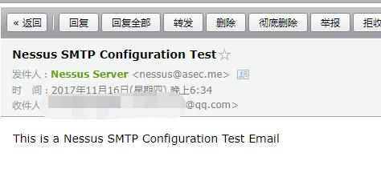
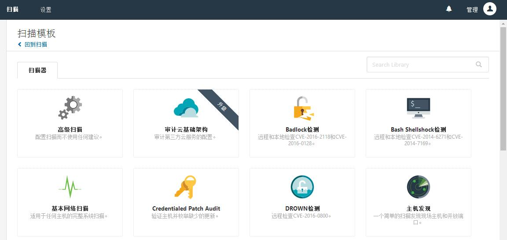
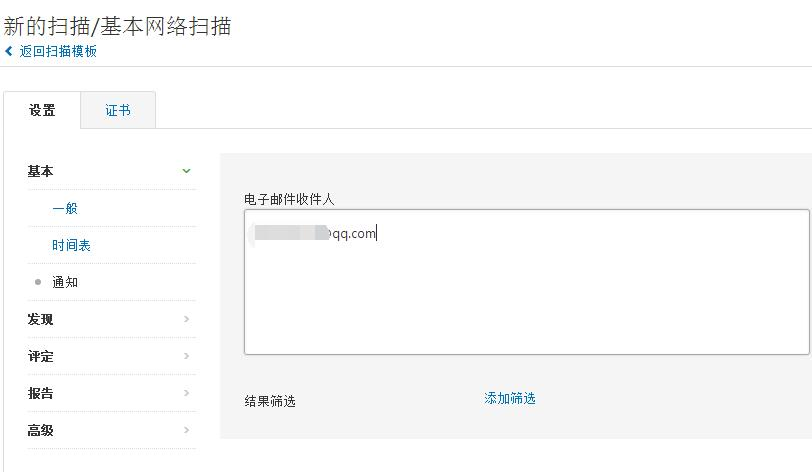
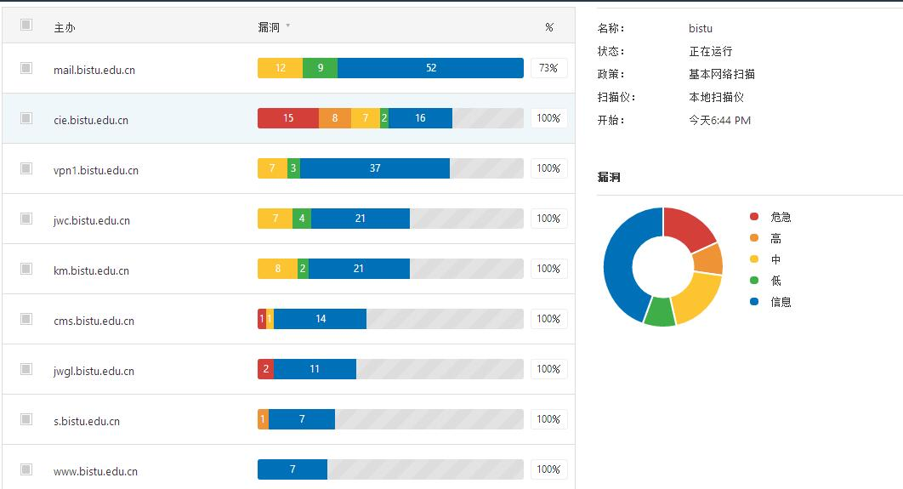
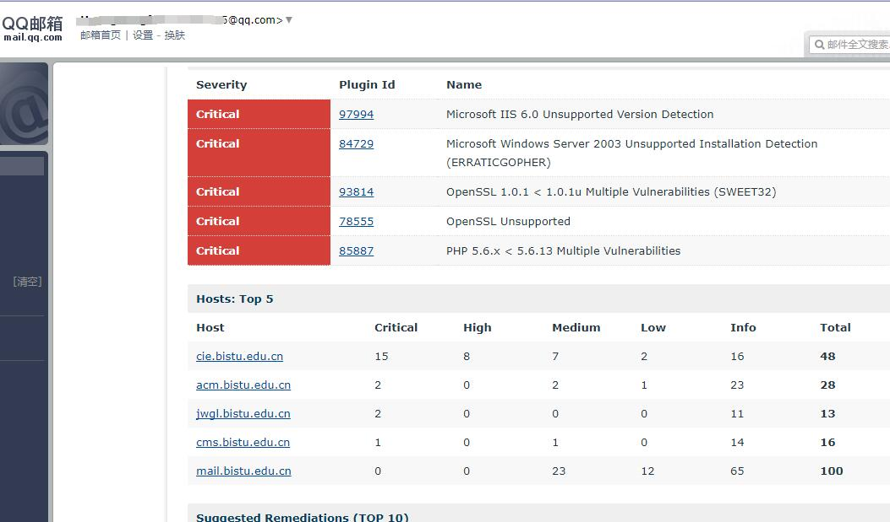
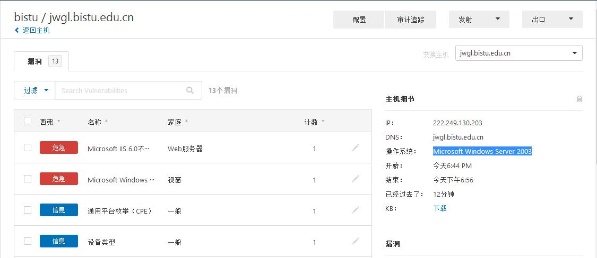

### 下载安装

下载地址:[点击直达](https://www.tenable.com/products/nessus/select-your-operating-system#download)

注册地址:[点击直达](https://www.tenable.com/products/nessus-home)

填写姓名邮箱注册后会收到一封带有激活码的邮件:
```
Your activation code for the Nessus Home is 
5966-C051-BC36-B544-821D

This is a one-time code. If you un-install and then re-install Nessus, 
you will need to register the scanner again and receive another Activation Code.
```
为了以后不收到`tenable`的产品推销邮件,可以使用十分钟邮箱: [10minutemail.net](https://10minutemail.net/readmail.html?mid=QEw81T)

安装并启动 nessus:

```
dpkg -i Nessus-*.deb
/etc/init.d/nessusd start 

lsof -i :8834
COMMAND  PID USER   FD   TYPE DEVICE SIZE/OFF NODE NAME
nessusd 2887 root   13u  IPv4  38898      0t0  TCP *:8834 (LISTEN)
nessusd 2887 root   14u  IPv6  38899      0t0  TCP *:8834 (LISTEN)
```

启动之后访问`https://ip:8834/`

设置管理帐号和密码,设置完之后需要输入Active code才可以进行插件的更新安装


由于众所周知的原因,不出意外的话,安装插件过程中会出错:

```
NOTICE: An unexpected error occurred while downloading the plugins. 
This could be due to a network error, lack of disk space, or something else entirely. 
Please take one of the following corrective actions:

Run the 'nessuscli update' command for your respective platform.
Request help from Tenable Customer Support
```

由于**GFW**的存在, 根据页面提示运行`nessuscli update`也会出错
这时需要配置代理,使用`proxychain-ng`代理`nessuscli`:
```
proxychains4 /opt/nessus/sbin/nessuscli update
```


下载速度飞快! 安装完插件后重启`nessusd`:

```
/etc/init.d/nessusd restart
```
再次访问`https://ip:8834/`,会出现`Initializing, please wait...`,速度奇慢无比,不过不会出错,慢慢等就行了。

### Nessus 使用

#### 配置SMTP服务

在`Settings`-`SMTP Server`，填写smtp服务器,端口号,账号密码等信息.发送测试邮件.

收到测试邮件如图:



#### 新建扫描

在 `scans` - `New Scan` 可以看到有很多的扫描模板, 有一部分需要人民币玩家才能解锁姿势,
这里选择的是`Basic Network Scan`(基本网络扫描)




选定扫描模板后,可以自己在`settings`中设置自己要的一些参数,这里我设置了`Basic` - `Notifications`为自己邮箱,Nessus在扫描完成后会通过配置的 SMTP 服务器把扫描结果发生到邮箱中。



配置完成后在`My Scans` 中可以看到,点击`Launch`开始扫描

扫描过程中可以点进去,看看扫描进度



也可以去干些别的,等扫描完成后结果会通过邮件发送到邮箱中



从扫描结果可以看出`jwgl.bistu.edu.cn`的`web服务器`为`IIS6.0`,理论上存在文件解析漏洞,**有可能**可以通过上传图片马拿到webshell.




参考链接:

- [Kali 安装 Nessus 详细过程](http://blog.csdn.net/u012318074/article/details/72354387)
- [使用Nessus----大学霸 Kali Linux 安全渗透教程](https://wizardforcel.gitbooks.io/daxueba-kali-linux-tutorial/content/27.html)

