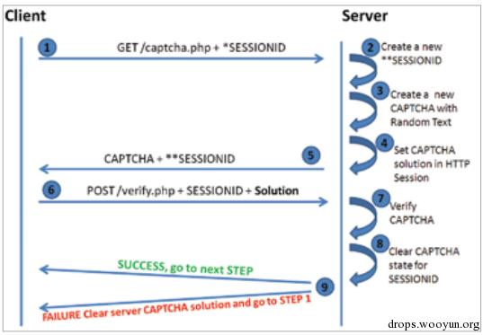

### 验证码相关安全问题

##### 乌云知识库:

- [验证码安全问题汇总](http://drops.ichenfei.com/web-5459.html)
- [聊一聊随机数安全](http://drops.ichenfei.com/tips-141.html)
- [密码找回逻辑漏洞总结](http://drops.ichenfei.com/web-5048.html)
- [一些常见的重置密码漏洞分析整理](http://drops.ichenfei.com/papers-2035.html)

##### 其他相关文章
- [【安全加固】 验证码的实现原理和安全问题汇总](http://www.cnbraid.com/2016/captcha.html)
- [验证码原理分析及实现](http://blog.csdn.net/niaonao/article/details/51112686)
- [随机数字图片验证码的原理、生成和破解](https://lizonghang.github.io/2016/07/10/%E9%9A%8F%E6%9C%BA%E6%95%B0%E5%AD%97%E5%9B%BE%E7%89%87%E9%AA%8C%E8%AF%81%E7%A0%81%E7%9A%84%E5%8E%9F%E7%90%86%E3%80%81%E7%94%9F%E6%88%90%E5%92%8C%E7%A0%B4%E8%A7%A3/)
- [图形验证码的常见安全问题](http://www.lijiejie.com/safe-issues-of-captcha/)

##### 乌云相关案例

- [http://wy.ichenfei.com/searchbug.php?q=验证码](http://wy.ichenfei.com/searchbug.php?q=%E9%AA%8C%E8%AF%81%E7%A0%81)
<!-- - [http://es.ichenfei.com:8000/wysearch/?q=验证码](http://es.ichenfei.com:8000/wysearch/?q=验证码) -->

##### 验证码实现原理

1. 客户端发起一个请求；
2. 服务端响应并创建一个新的SessionID同时生成一个随机验证码；
3. 服务端将验证码和SessionID一并返回给客户端；
4. 客户端提交验证码连同SessionID给服务端；
5. 服务端验证验证码同时销毁当前Session中的验证码，返回给客户端结果。

根据上面的实现流程，可以从四个方面入手，**客户端问题**、**服务端问题**、**验证码本身问题**,还有一个**验证码流程设计**问题。

##### 客户端问题

- 客户端生成验证码
	- 验证码由客户端js生成并且仅仅在客户端用js验证
- 验证码输出客户端
	- 输出在html中（神一样的程序员）
- 验证码输出在cookie中，这个在乌云中案例也是比较多的。

##### 服务端问题

- 验证码不过期，没有及时销毁会话导致验证码复用
	- 这个是最常见的，乌云上面有大量的案例。
- 没有进行非空判断
	- 很多时候，我们会遗留掉了验证过程中验证码为空的情况
	- 比如去掉cookie中的某些值或者请求中验证码参数
- 产生的验证码问题集内的答案非常有限

##### 其他类型验证码绕过
